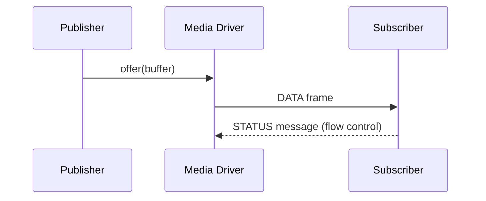

# Tutorial Style Guide — Material for MkDocs

Applies to every lesson under `docs/tutorial/**/*.md`. The goal is a consistent,
visually rich style using Material for MkDocs features already enabled in
`mkdocs.yml` (admonition, pymdownx.details, tabbed, superfences+mermaid,
tasklist, keys, mark, attr_list, md_in_html).

Do **not** rewrite the pedagogy. Preserve every technical fact, code sample,
exercise, and acceptance criterion. This is a presentation + API-accuracy pass.

## 1. Admonitions — replace bare prose headers with typed callouts

Map the existing informal sections onto Material admonition types:

| Existing intent                    | Use                                    |
| ---------------------------------- | -------------------------------------- |
| "What You'll Build" / goals list   | `!!! abstract "What you'll build"`     |
| Aeron/Zig background aside         | `!!! info "Aeron concept"` / `"Zig concept"` |
| Helpful pointer, shortcut          | `!!! tip`                              |
| Gotcha, must-not-do, untrusted data| `!!! warning` (or `!!! danger` for UB/safety) |
| The exercise                       | `!!! question "Exercise"`              |
| Acceptance criteria                | task list inside the exercise admonition |
| "Key Takeaways"                    | `!!! success "Key takeaways"`          |
| Long optional deep-dive            | collapsible `??? note "…"`             |

Rules:
- Blank line after the `!!! type "Title"` line; indent body **4 spaces**.
- Keep at most one admonition type per idea; don't nest deeply.
- Acceptance criteria become a task list:
  ```
  !!! question "Exercise"
      Implement `onRequestVote` …

      - [ ] Deny if `candidate_term_id < leader_ship_term_id`
      - [ ] Grant vote and update term when checks pass
  ```

## 2. Mermaid — add at least one diagram per lesson

Every lesson gets **≥1** mermaid diagram. Pick the form that fits the content;
prefer replacing an existing ASCII art / bullet-flow with a diagram (keep byte-
layout ASCII tables — those are clearer as tables/ASCII).

- **`sequenceDiagram`** — protocol exchanges, request/response, pub→driver→sub flows.
- **`stateDiagram-v2`** — state machines (election, publication lifecycle, fragment reassembly).
- **`flowchart LR/TD`** — data path, decision logic, module wiring, poll loops.
- **`classDiagram`** — struct relationships / field ownership when useful.

Fence with ```` ```mermaid ````. Keep labels short. Example:



Do **not** convert the wire byte-layout diagrams (the `+--0--+--1--+` tables) to
mermaid — leave those; they document exact offsets.

## 3. Content tabs — when comparing two things

Use `=== "Label"` tabs for genuine either/or comparisons: Zig vs Java, before vs
after, IPC vs UDP. Don't tab unrelated content.

```
=== "Zig"
    ```zig
    var gpa = std.heap.DebugAllocator(.{}){};
    ```
=== "Java (reference)"
    ```java
    ...
    ```
```

## 4. Zig 0.16 API — fix stale snippets

The source already migrated to Zig 0.16 (commit `chore: migrate to zig 0.16`).
Update any code snippet using pre-0.16 stdlib. Reference file: `src/io.zig`,
`src/archive/catalog.zig`, `src/archive/recorder.zig`.

| Pre-0.16 (wrong)                              | Zig 0.16 (correct)                                             |
| --------------------------------------------- | ------------------------------------------------------------- |
| `std.heap.GeneralPurposeAllocator(.{}){}`     | `std.heap.DebugAllocator(.{}){}`                              |
| `std.ArrayListUnmanaged(T){}` / `ArrayList(T).init(a)` | `std.ArrayList(T)` field, init `.empty`, `deinit(allocator)` |
| `std.fs.File`                                 | `std.Io.File`                                                  |
| `std.fs.cwd().openFile(path, .{})`            | `std.Io.Dir.cwd().openFile(io_mod.io(), path, .{})`           |
| `std.fs.cwd().createFile(path, .{...})`       | `std.Io.Dir.cwd().createFile(io_mod.io(), path, .{...})`      |
| `std.fs.cwd().makePath(dir)`                  | `std.Io.Dir.cwd().createDirPath(io_mod.io(), dir)`            |
| `file.writeAll(data)`                         | `file.writeStreamingAll(io_mod.io(), data)`                   |
| `file.close()`                                | `file.close(io_mod.io())`                                     |
| `file.sync()`                                 | `file.sync(io_mod.io())`                                       |
| `std.process.argsAlloc(a)` / `argsFree`       | `init.minimal.args.toSlice(a)` / `a.free(args)`               |
| `std.time.nanoTimestamp()` (in migrated files)| via local `time` module: `time.nanoTimestamp()`               |

`io_mod` is `const io_mod = @import("../io.zig");` (adjust `../` depth). When a
snippet shows file I/O, add a one-line `!!! note` explaining that Zig 0.16 threads
an `std.Io` through file ops and the project hands it out via `io_mod.io()`.

Only touch API that actually appears. Do not invent I/O where the lesson had none.

## 5. Invariants — do not break

- Keep the H1 lesson number/title (`# 1.1 Frame Codec`).
- Keep all `make …` commands, file paths, and "Compare against `src/…`" pointers.
- Keep the "Next, we'll …" closing sentence if present.
- No emojis. 2-space indent only matters for the diagrams' internal YAML-ish;
  admonition bodies use 4-space indent (Material requirement).
- After editing, the file must still be valid Markdown (mermaid fences closed,
  admonition indentation correct).
