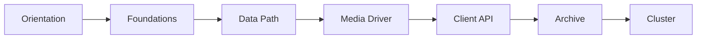

# Aeron in Zig

Build a wire-compatible Aeron implementation in Zig, from frame codecs and shared-memory IPC through Archive and Cluster.

The course is designed for systems engineers who want both sides of the stack:

- **Aeron internals**: UDP framing, flow control, log buffers, media driver agents, Archive replay, and Cluster consensus.
- **Zig systems programming**: explicit allocators, atomics, `extern struct` layouts, `mmap`, POSIX networking, and compile-time checks.

## Start Here

| Path | Purpose |
| ---- | ------- |
| [Tutorial Overview](tutorial/README.md) | Course map, learning tracks, and chapter order |
| [System Tour](tutorial/00-orientation/03-system-tour.md) | First pass through the architecture |
| [Frame Codec](tutorial/01-foundations/01-frame-codec.md) | First implementation chapter |
| [Architecture Guide](guides/architecture.md) | Reference view of the finished system |

## Work Loop

```bash
make docs-serve       # preview this site
make tutorial-check   # compile-check learner stubs
make check            # verify the reference implementation
```

## Course Shape



Each chapter points at a `tutorial/` stub and a matching `src/` reference implementation. Read the chapter first, implement the stub, then compare against the reference when stuck.

## Docs Index

## Core

- `plan.md` — top-level roadmap and phase status
- `guides/architecture.md` — system architecture and module map
- `guides/setup.md` — local development, interop, and environment setup

## Plans

- `plans/` — dated execution plans and phase-specific implementation plans

## Specs

- `specs/` — approved design docs and phase specifications

## Audits

- `audits/` — repository and compatibility audits

## Investigations

- `investigations/` — one-off debugging writeups worth keeping as reference

## Templates

- `templates/` — reusable agent or workflow templates

## Course

- `course/` — course-wide gap reports
- `tutorial/` — chapter-by-chapter tutorial content
