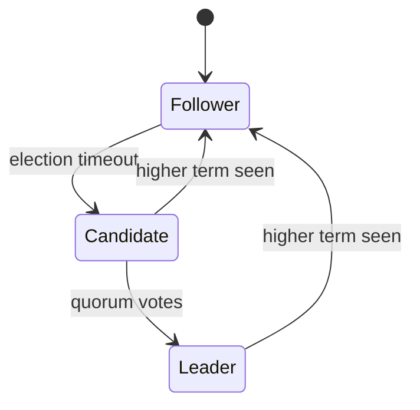

# Phase 9 — Tutorial Completion & Protocol Polish

**Goal:** Complete the tutorial course (55% → 100%) and close the remaining upstream parity gaps (IPC keepalive, cluster snapshots).

**Architecture:** Sequential tasks, each independently shippable. Tutorial work comes first (higher learner impact), protocol polish last (lower urgency). All code changes go through `make check` before commit.

**Tech Stack:** Zig 0.15.2, `make check` / `make tutorial-check`, git tags for chapter checkpoints.

---

## Track A — Tutorial (Tasks 1–9)

### Task 1: Create chapter git tags

**Goal:** Tag the 17 already-complete chapters on main so learners can use `git diff chapter-01-frame-codec chapter-02-ring-buffer`.

**Files:**
- No file changes. Git tags only.

**Steps:**

- [ ] Find the commit where each module first landed by scanning `git log --oneline`:

```bash
git log --oneline --all
```

Use the following mapping heuristic — the earliest commit that added the file is the chapter point:

| Chapter slug | Key file added |
|---|---|
| `chapter-00-01-what-is-aeron` | `docs/tutorial/part0/00-01-what-is-aeron.md` |
| `chapter-00-02-what-is-zig` | `docs/tutorial/part0/00-02-what-is-zig.md` |
| `chapter-00-03-system-tour` | `docs/tutorial/part0/00-03-system-tour.md` |
| `chapter-00-04-first-pubsub` | `docs/tutorial/part0/00-04-first-pubsub.md` |
| `chapter-01-01-frame-codec` | `src/protocol/frame.zig` |
| `chapter-01-02-ring-buffer` | `src/ipc/ring_buffer.zig` |
| `chapter-01-03-broadcast` | `src/ipc/broadcast.zig` |
| `chapter-01-04-counters` | `src/ipc/counters.zig` |
| `chapter-01-05-log-buffer` | `src/logbuffer/` |
| `chapter-02-01-term-appender` | `src/logbuffer/term_appender.zig` |
| `chapter-02-02-term-reader` | `src/logbuffer/term_reader.zig` |
| `chapter-02-03-udp-transport` | `src/transport/udp_channel.zig` |
| `chapter-03-01-sender` | `src/driver/sender.zig` |
| `chapter-03-02-receiver` | `src/driver/receiver.zig` |
| `chapter-03-03-conductor` | `src/driver/conductor.zig` |
| `chapter-03-04-media-driver` | `src/driver/media_driver.zig` |
| `chapter-04-01-publications` | `src/publication.zig` |
| `chapter-04-02-subscriptions` | `src/subscription.zig` |
| `chapter-04-03-integration-tests` | `test/integration/` |

- [ ] For each chapter, run:

```bash
# Example — find commit that added frame.zig:
git log --oneline --diff-filter=A -- src/protocol/frame.zig

# Then tag it:
git tag chapter-01-01-frame-codec <commit-sha>
```

Repeat for all 17 chapters above.

- [ ] Verify tags created:

```bash
git tag | grep chapter | sort
# Expected: 17 lines, one per chapter
```

- [ ] Do NOT push tags yet — user confirms before `git push --tags`.

---

### Task 2: Fix LESSON annotation slugs

**Goal:** Update slugs in `src/` so every `// LESSON(slug):` matches an actual `docs/tutorial/` filename.

**Files:**
- Modify: `src/ipc/broadcast.zig`, `src/ipc/counters.zig`, `src/logbuffer/*.zig`, `src/transport/*.zig`, `src/archive/*.zig`, `src/cluster/*.zig`

**Problem:** Annotations use parent prefixes like `transport/aeron` or `archive/zig` instead of exact chapter slugs like `udp-transport` or `archive-protocol`.

**Correct slug format per spec:** `// LESSON(chapter-slug): reason. See docs/tutorial/partN/NN-NN-chapter-slug.md`

**Steps:**

- [ ] Search for all current LESSON annotations:

```bash
grep -rn '// LESSON(' src/ | sort
```

- [ ] For each annotation with a non-matching slug, update it to the correct chapter slug. Mapping:

| Old prefix | Correct slug |
|---|---|
| `transport/aeron` | `udp-transport` |
| `transport/zig` | `udp-transport` |
| `archive/aeron` | `archive-protocol` (for protocol.zig) or `recorder` / `replayer` / etc. by file |
| `archive/zig` | same as above, by file |
| `cluster/aeron` | `cluster-protocol` (for protocol.zig) or `election` / `log-replication` / etc. by file |
| `cluster/zig` | same as above, by file |
| `aeron/aeron` | `what-is-aeron` |
| `aeron/zig` | `what-is-zig` |
| `conductor/aeron` | `conductor` |
| `conductor/zig` | `conductor` |
| `sender/aeron` | `sender` |
| `sender/zig` | `sender` |
| `media-driver/aeron` | `media-driver` |
| `media-driver/zig` | `media-driver` |

- [ ] After edits, verify no stale prefixes remain:

```bash
grep -rn '// LESSON(' src/ | grep -v 'See docs/tutorial'
# Expected: empty (every LESSON should have a See link)
```

- [ ] Run check:

```bash
make check
```

Expected: green.

- [ ] Stage and commit:

```bash
git add src/
git commit -m "fix: normalize LESSON annotation slugs to exact chapter names"
```

---

### Task 3: Add missing LESSON annotations

**Goal:** Add LESSON annotations to the 10 chapters currently with zero coverage.

**Files:**
- Modify: `src/ipc/broadcast.zig` (01-03), `src/logbuffer/log_buffer.zig` and `src/logbuffer/term_appender.zig` (01-05), `src/archive/protocol.zig` (05-01), `src/archive/catalog.zig` (05-02), `src/archive/recorder.zig` (05-03), `src/archive/replayer.zig` (05-04), `src/archive/conductor.zig` (05-05), `src/cluster/protocol.zig` (06-01), `src/cluster/election.zig` (06-02), `src/cluster/replication.zig` (06-03), `src/cluster/conductor.zig` (06-04)

**Annotation format:**
```zig
// LESSON(chapter-slug): <why this design choice matters>. See docs/tutorial/partN/NN-NN-chapter-slug.md
```

**Steps:**

- [ ] For each file, add 2–4 LESSON annotations on the key structs and functions:

  **`src/ipc/broadcast.zig`** — add to `BroadcastTransmitter` struct and `transmit` function:
  ```zig
  // LESSON(broadcast): BroadcastTransmitter is many-writers-one-reader over shared memory;
  // the version counter prevents torn reads. See docs/tutorial/part1/01-03-broadcast.md
  ```

  **`src/logbuffer/log_buffer.zig`** — add to `LogBuffer` struct and `activeTermIndex`:
  ```zig
  // LESSON(log-buffer): Three rotating terms let the publisher wrap without the subscriber
  // seeing a gap; term_count % 3 picks the active partition. See docs/tutorial/part1/01-05-log-buffer.md
  ```

  **`src/archive/protocol.zig`** — add to `StartRecordingRequest`, `RecordingDescriptor`:
  ```zig
  // LESSON(archive-protocol): All archive control messages use fixed-size extern structs
  // followed by a variable-length channel string. See docs/tutorial/part5/05-01-archive-protocol.md
  ```

  **`src/archive/catalog.zig`** — add to `Catalog` struct and `append`:
  ```zig
  // LESSON(catalog): The catalog is a flat binary file of fixed-size descriptors;
  // position = recording_id * descriptor_size. See docs/tutorial/part5/05-02-catalog.md
  ```

  **`src/archive/recorder.zig`** — add to `Recorder` and `writeFragment`:
  ```zig
  // LESSON(recorder): Recorder writes Aeron fragments to a segmented log file;
  // each segment is a power-of-2 size to keep seeks cheap. See docs/tutorial/part5/05-03-recorder.md
  ```

  **`src/archive/replayer.zig`** — add to `Replayer` and `poll`:
  ```zig
  // LESSON(replayer): Replayer reads from a recording segment and offers frames
  // to a Publication; flow control comes from back-pressure. See docs/tutorial/part5/05-04-replayer.md
  ```

  **`src/archive/conductor.zig`** — add to `ArchiveConductor.doWork`:
  ```zig
  // LESSON(archive-conductor): The archive conductor is the same duty-cycle pattern
  // as the media driver conductor — poll IPC, dispatch commands. See docs/tutorial/part5/05-05-archive-conductor.md
  ```

  **`src/cluster/protocol.zig`** — add to `RequestVoteHeader`, `AppendRequestHeader`:
  ```zig
  // LESSON(cluster-protocol): Every Raft message is an extern struct with explicit
  // _padding fields to maintain 64-bit alignment across shared memory. See docs/tutorial/part6/06-01-cluster-protocol.md
  ```

  **`src/cluster/election.zig`** (or equivalent) — add to election state machine:
  ```zig
  // LESSON(election): The Raft election timeout is randomized per member to avoid
  // split-vote deadlocks; a member becomes candidate after its timer fires. See docs/tutorial/part6/06-02-election.md
  ```

  **`src/cluster/replication.zig`** (or conductor equivalent) — add to log append:
  ```zig
  // LESSON(log-replication): The leader sends AppendRequest; followers ACK with
  // AppendPosition; commit advances only when a quorum ACKs. See docs/tutorial/part6/06-03-log-replication.md
  ```

- [ ] Run check:

```bash
make check
```

- [ ] Count annotations — should be 87 + at least 20 new ones:

```bash
grep -rn '// LESSON(' src/ | wc -l
```

- [ ] Commit:

```bash
git add src/
git commit -m "docs: add LESSON annotations for broadcast, log-buffer, archive, cluster chapters"
```

---

### Task 4: Add pre-written tests for transport tutorial stubs

**Goal:** The 4 transport tutorial stubs (endpoint, poller, udp_channel, uri) have 32 TODO panics but zero pre-written tests. Add tests so learners know what to implement.

**Files:**
- Modify: `tutorial/transport/endpoint.zig`, `tutorial/transport/poller.zig`, `tutorial/transport/udp_channel.zig`, `tutorial/transport/uri.zig`

**Steps:**

- [ ] Read each stub file first, then add `test` blocks at the bottom. Tests must compile even when the stub panics (they run at learner's opt-in via `-Dchapter=N`).

  **`tutorial/transport/uri.zig`** — add tests:
  ```zig
  test "parse basic udp uri" {
      const uri = try AeronUri.parse(std.testing.allocator, "aeron:udp?endpoint=localhost:20121");
      defer uri.deinit(std.testing.allocator);
      try std.testing.expectEqualStrings("localhost:20121", uri.endpoint() orelse "");
  }

  test "parse ipc uri" {
      const uri = try AeronUri.parse(std.testing.allocator, "aeron:ipc");
      defer uri.deinit(std.testing.allocator);
      try std.testing.expect(uri.endpoint() == null);
  }

  test "control mode from string" {
      try std.testing.expectEqual(ControlMode.dynamic, try ControlMode.fromString("dynamic"));
      try std.testing.expectError(error.InvalidControlMode, ControlMode.fromString("unknown"));
  }
  ```

  **`tutorial/transport/udp_channel.zig`** — add tests:
  ```zig
  test "parse udp channel" {
      const ch = try UdpChannel.parse(std.testing.allocator, "aeron:udp?endpoint=127.0.0.1:40123");
      defer ch.deinit(std.testing.allocator);
      try std.testing.expect(!ch.isMulticast());
  }

  test "parse multicast channel" {
      const ch = try UdpChannel.parse(std.testing.allocator, "aeron:udp?endpoint=224.0.1.1:40123");
      defer ch.deinit(std.testing.allocator);
      try std.testing.expect(ch.isMulticast());
  }
  ```

  **`tutorial/transport/poller.zig`** — add tests:
  ```zig
  test "poller init and deinit" {
      var p = try Poller.init(std.testing.allocator, 4);
      defer p.deinit(std.testing.allocator);
      try std.testing.expectEqual(@as(usize, 0), p.readyFds().len);
  }
  ```

  **`tutorial/transport/endpoint.zig`** — add tests:
  ```zig
  test "send endpoint open and close" {
      var ep = try SendChannelEndpoint.open(std.testing.allocator, "127.0.0.1", 0);
      defer ep.close();
  }
  ```

- [ ] Verify tutorial stubs still compile:

```bash
make tutorial-check
```

Expected: compiles (stubs still have panics, tests are gated by `-Dchapter`).

- [ ] Commit:

```bash
git add tutorial/transport/
git commit -m "test: add pre-written tutorial tests for transport stubs (endpoint, poller, udp_channel, uri)"
```

---

### Task 5: Fill transport tutorial stubs

**Goal:** Implement the 32 TODO panics in `tutorial/transport/` by mirroring `src/transport/`.

**Files:**
- Modify: `tutorial/transport/uri.zig`, `tutorial/transport/udp_channel.zig`, `tutorial/transport/poller.zig`, `tutorial/transport/endpoint.zig`
- Reference: `src/transport/uri.zig`, `src/transport/udp_channel.zig`, `src/transport/poller.zig`, `src/transport/endpoint.zig`

**Steps:**

For each stub file:

- [ ] Read `src/transport/<file>.zig` (reference)
- [ ] Read `tutorial/transport/<file>.zig` (stub)
- [ ] Replace each `@panic("TODO: implement")` with the implementation from `src/`, simplified to the minimum needed to pass the pre-written tests. Do not copy verbatim — keep it clean and commented for learners.
- [ ] Run tests for that file:

```bash
make tutorial-check
# or specifically:
nix develop --command zig build tutorial-test -Dchapter=2
```

Expected: chapter 2.3 tests pass.

- [ ] After all 4 files are done, run full check:

```bash
make check
make tutorial-check
```

- [ ] Commit:

```bash
git add tutorial/transport/
git commit -m "feat(tutorial): implement transport stubs (uri, udp_channel, poller, endpoint)"
```

---

### Task 6: Fill remaining tutorial stubs

**Goal:** Implement the remaining 8 TODO panics across frame, conductor, and cnc stubs.

**Files:**
- Modify: `tutorial/protocol/frame.zig` (2 TODOs: `alignedLength`, `computeMaxPayload`)
- Modify: `tutorial/driver/conductor.zig` (2 TODOs: `doWork`, `handleAddPublication`)
- Modify: `tutorial/driver/cnc.zig` (1 TODO: `CncFile.create`)
- Modify: `tutorial/cnc.zig` (3 TODOs: `cncFilePath`, `errorLogPath`, `lossReportPath`)
- Reference: `src/protocol/frame.zig`, `src/driver/conductor.zig`, `src/cnc.zig`

**Steps:**

- [ ] **`tutorial/protocol/frame.zig`** — implement `alignedLength` and `computeMaxPayload`:

```zig
// alignedLength: pad data_length up to the nearest 32-byte boundary
pub fn alignedLength(data_length: usize) usize {
    return (data_length + (FRAME_ALIGNMENT - 1)) & ~(FRAME_ALIGNMENT - 1);
}

// computeMaxPayload: subtract DataHeader from mtu
pub fn computeMaxPayload(mtu: usize) usize {
    return mtu - DataHeader.LENGTH;
}
```

- [ ] Run existing tests:

```bash
nix develop --command zig build tutorial-test -Dchapter=1
```

Expected: frame codec tests pass.

- [ ] **`tutorial/driver/conductor.zig`** — implement `doWork` (drain ring buffer, dispatch commands) and `handleAddPublication` (allocate log buffer, send ready). Mirror `src/driver/conductor.zig` key paths only.

- [ ] **`tutorial/driver/cnc.zig`** — implement `CncFile.create` (write magic number + metadata at offset 0).

- [ ] **`tutorial/cnc.zig`** — implement the three path helpers:

```zig
pub fn cncFilePath(aeron_dir: []const u8, buf: []u8) []const u8 {
    return std.fmt.bufPrint(buf, "{s}/cnc.dat", .{aeron_dir}) catch unreachable;
}
```

- [ ] Run tutorial check:

```bash
make tutorial-check
```

- [ ] Commit:

```bash
git add tutorial/protocol/ tutorial/driver/ tutorial/cnc.zig
git commit -m "feat(tutorial): implement remaining stubs (frame helpers, conductor, cnc)"
```

---

### Task 7: Write Part 5 — Archive tutorial docs (6 chapters)

**Goal:** Expand 6 stub-level archive chapters from ~1.3 KB placeholders to full walkthroughs (target: 4–7 KB each).

**Files:**
- Modify: `docs/tutorial/part5/05-01-archive-protocol.md`
- Modify: `docs/tutorial/part5/05-02-catalog.md`
- Modify: `docs/tutorial/part5/05-03-recorder.md`
- Modify: `docs/tutorial/part5/05-04-replayer.md`
- Modify: `docs/tutorial/part5/05-05-archive-conductor.md`
- Modify: `docs/tutorial/part5/05-06-archive-main.md`
- Reference: `src/archive/`, `.agents/PARITY_AUDIT.md` (archive section)

**Chapter template** (from spec `docs/specs/2026-03-17-tutorial-course-design.md`):
```
## What You'll Build
## Why It Works This Way (Aeron Concept)
## Zig Concept: [relevant Zig feature]
## The Code
## Exercise
## Check Your Work
## Key Takeaways
```

**Steps (repeat for each chapter):**

- [ ] Read the current stub: `docs/tutorial/part5/05-0N-<slug>.md`
- [ ] Read the corresponding `src/archive/<file>.zig` for implementation details
- [ ] Write the chapter using the template above. Include:
  - Mermaid diagrams for data flow where useful
  - Inline code snippets from `src/` (not tutorial stubs)
  - A concrete exercise with acceptance criteria
  - "Zig Concept" section (e.g., 05-03 = file I/O + segment rotation; 05-02 = flat binary format + seek)

**Chapter-specific focus:**

| Chapter | Zig Concept | Aeron Concept |
|---------|-------------|---------------|
| 05-01 archive-protocol | `extern struct` with variable-length suffix | SBE-inspired fixed+variable encoding |
| 05-02 catalog | flat binary files + seek | recording ID → file offset |
| 05-03 recorder | `std.fs.File` + segment rotation | streaming write to disk |
| 05-04 replayer | reading file → Publication offer | replay as a Publisher |
| 05-05 archive-conductor | same duty-cycle as media conductor | IPC command dispatch |
| 05-06 archive-main | `ArchiveContext` + thread management | standalone archive process |

- [ ] After each chapter is written, verify links:

```bash
grep -n 'See docs/tutorial' src/archive/ | grep '05-0N'
# Should point to the chapter you just wrote
```

- [ ] Commit after each chapter:

```bash
git add docs/tutorial/part5/05-0N-<slug>.md
git commit -m "docs(tutorial): write Part 5 chapter 05-0N — <slug>"
git tag chapter-05-0N-<slug>
```

---

### Task 8: Write Part 6 — Cluster tutorial docs (5 chapters)

**Goal:** Expand 5 stub-level cluster chapters from ~1.5–2.8 KB placeholders to full walkthroughs.

**Files:**
- Modify: `docs/tutorial/part6/06-01-cluster-protocol.md`
- Modify: `docs/tutorial/part6/06-02-election.md`
- Modify: `docs/tutorial/part6/06-03-log-replication.md`
- Modify: `docs/tutorial/part6/06-04-cluster-conductor.md`
- Modify: `docs/tutorial/part6/06-05-cluster-main.md`
- Reference: `src/cluster/`, `.agents/PARITY_AUDIT.md` (cluster section)

**Chapter-specific focus:**

| Chapter | Zig Concept | Aeron Concept |
|---------|-------------|---------------|
| 06-01 cluster-protocol | `extern struct` + explicit `_padding` for alignment | SBE consensus message layout |
| 06-02 election | tagged union state machine | Raft leader election + randomized timeout |
| 06-03 log-replication | atomic commit index + follower ACK | quorum-based log commit |
| 06-04 cluster-conductor | `comptime` interface for service callbacks | session management + command dispatch |
| 06-05 cluster-main | multi-thread orchestration | ConsensusModule + standalone binary |

**Steps (repeat for each chapter):**

- [ ] Read stub, read `src/cluster/<file>.zig`
- [ ] Write using chapter template; include Raft state diagrams in Mermaid
- [ ] 06-02 election must include a state machine diagram:



- [ ] Commit + tag after each chapter:

```bash
git add docs/tutorial/part6/06-0N-<slug>.md
git commit -m "docs(tutorial): write Part 6 chapter 06-0N — <slug>"
git tag chapter-06-0N-<slug>
```

---

### Task 9: Add CI lint for LESSON slug consistency

**Goal:** Add a `make lesson-lint` target that fails if any LESSON slug does not correspond to an existing `docs/tutorial/` file. Prevents future slug drift.

**Files:**
- Modify: `Makefile`
- Create: `scripts/lesson-lint.sh`

**Steps:**

- [ ] Write `scripts/lesson-lint.sh`:

```bash
#!/usr/bin/env bash
set -euo pipefail

ERRORS=0
while IFS= read -r line; do
    # Extract slug from: // LESSON(slug): ...
    slug=$(echo "$line" | sed -n 's|.*// LESSON(\([^)]*\)):.*|\1|p')
    [ -z "$slug" ] && continue

    # Check if a matching docs/tutorial/ file exists
    if ! find docs/tutorial -name "*${slug}*" | grep -q .; then
        echo "MISSING: LESSON($slug) has no matching docs/tutorial file"
        ERRORS=$((ERRORS + 1))
    fi
done < <(grep -rn '// LESSON(' src/)

if [ "$ERRORS" -gt 0 ]; then
    echo "$ERRORS LESSON slug(s) missing tutorial docs" >&2
    exit 1
fi
echo "All LESSON slugs verified OK"
```

- [ ] Make it executable:

```bash
chmod +x scripts/lesson-lint.sh
```

- [ ] Add to `Makefile`:

```makefile
lesson-lint:  ## Verify all LESSON annotation slugs map to existing docs/tutorial/ files
	bash scripts/lesson-lint.sh
```

- [ ] Run it:

```bash
make lesson-lint
```

Expected: all green after Tasks 2 and 3 are done.

- [ ] Commit:

```bash
git add Makefile scripts/lesson-lint.sh
git commit -m "chore: add make lesson-lint to catch LESSON slug drift"
```

---

## Track B — Protocol Polish (Tasks 10–12)

### Task 10: Implement CLIENT_KEEPALIVE and TERMINATE_DRIVER

**Goal:** Add upstream IPC command types `CLIENT_KEEPALIVE (0x06)` and `TERMINATE_DRIVER (0x0E)` to conductor so drivers can detect dead clients and accept graceful shutdown requests.

**Files:**
- Modify: `src/driver/conductor.zig` — handle the two new command types
- Modify: `src/ipc/ring_buffer.zig` — add the type constants if not already present
- Test: inline `test` block in `src/driver/conductor.zig`

**Steps:**

- [ ] Add type constants to `src/ipc/ring_buffer.zig` if missing:

```zig
pub const CLIENT_KEEPALIVE_MSG_TYPE: i32 = 0x06;
pub const TERMINATE_DRIVER_MSG_TYPE: i32 = 0x0E;
```

- [ ] Write failing tests first in `src/driver/conductor.zig`:

```zig
test "conductor handles CLIENT_KEEPALIVE — updates client liveness timestamp" {
    // setup minimal conductor with a test ring buffer
    // write a CLIENT_KEEPALIVE message
    // call conductor.doWork()
    // assert client liveness timestamp updated
}

test "conductor handles TERMINATE_DRIVER — sets shutdown flag" {
    // write TERMINATE_DRIVER message
    // call conductor.doWork()
    // assert signal.isRunning() == false or conductor.running == false
}
```

- [ ] Run tests to confirm they fail:

```bash
make test-unit 2>&1 | grep -A3 "CLIENT_KEEPALIVE\|TERMINATE_DRIVER"
```

- [ ] Implement in `src/driver/conductor.zig` dispatch switch:

```zig
CLIENT_KEEPALIVE_MSG_TYPE => {
    // Update per-client last-seen timestamp
    self.updateClientLiveness(correlation_id, std.time.nanoTimestamp());
},
TERMINATE_DRIVER_MSG_TYPE => {
    // Signal graceful shutdown
    signal.requestStop();
    log.info("TERMINATE_DRIVER received — initiating shutdown", .{});
},
```

- [ ] Run tests to confirm they pass:

```bash
make test-unit
```

- [ ] Run full check:

```bash
make check
```

- [ ] Commit:

```bash
git add src/driver/conductor.zig src/ipc/ring_buffer.zig
git commit -m "feat: implement CLIENT_KEEPALIVE and TERMINATE_DRIVER IPC commands"
```

---

### Task 11: Implement ON_OPERATION_SUCCESS broadcast response

**Goal:** Add a generic `ON_OPERATION_SUCCESS (0x0F04)` driver→client response for commands that succeed without a specific typed response.

**Files:**
- Modify: `src/driver/conductor.zig` — send ON_OPERATION_SUCCESS after applicable commands
- Modify: `src/ipc/broadcast.zig` — add `ON_OPERATION_SUCCESS_MSG_TYPE` constant and `sendOperationSuccess` helper
- Test: inline `test` in `src/driver/conductor.zig`

**Steps:**

- [ ] Write failing test:

```zig
test "conductor sends ON_OPERATION_SUCCESS after REMOVE_SUBSCRIPTION" {
    // setup
    // send REMOVE_SUBSCRIPTION
    // check broadcast receiver got ON_OPERATION_SUCCESS with matching correlation_id
}
```

- [ ] Run to confirm failure:

```bash
make test-unit 2>&1 | grep "ON_OPERATION_SUCCESS"
```

- [ ] Add constant and helper to `src/ipc/broadcast.zig`:

```zig
pub const ON_OPERATION_SUCCESS_MSG_TYPE: i32 = 0x0F04;

pub fn sendOperationSuccess(self: *BroadcastTransmitter, correlation_id: i64) !void {
    var buf: [16]u8 = undefined;
    std.mem.writeInt(i64, buf[0..8], correlation_id, .little);
    try self.transmit(ON_OPERATION_SUCCESS_MSG_TYPE, &buf, 8);
}
```

- [ ] Wire into conductor after REMOVE_SUBSCRIPTION and REMOVE_PUBLICATION handling.

- [ ] Run tests, then full check:

```bash
make test-unit
make check
```

- [ ] Commit:

```bash
git add src/driver/conductor.zig src/ipc/broadcast.zig
git commit -m "feat: implement ON_OPERATION_SUCCESS broadcast response for remove commands"
```

---

### Task 12: Implement SnapshotBegin/SnapshotEnd cluster messages

**Goal:** Add snapshot coordination codec messages for consistent cluster state capture.

**Files:**
- Modify: `src/cluster/protocol.zig` — add `SnapshotBegin` (type 231) and `SnapshotEnd` (type 232)
- Modify: `src/cluster/conductor.zig` — handle snapshot lifecycle in cluster conductor
- Test: inline `test` in `src/cluster/protocol.zig`

**Steps:**

- [ ] Write failing tests in `src/cluster/protocol.zig`:

```zig
test "SnapshotBegin size matches upstream" {
    comptime std.debug.assert(@sizeOf(SnapshotBegin) == 32);
}

test "SnapshotEnd size matches upstream" {
    comptime std.debug.assert(@sizeOf(SnapshotEnd) == 24);
}
```

- [ ] Run to confirm failure (structs don't exist yet):

```bash
make test-unit 2>&1 | grep "SnapshotBegin\|SnapshotEnd"
```

- [ ] Add structs to `src/cluster/protocol.zig`:

```zig
/// Type 231 — leader signals start of snapshot; all services must take snapshot.
pub const SnapshotBegin = extern struct {
    leadership_term_id: i64,
    log_position: i64,
    timestamp: i64,
    member_id: i32,
    _padding: i32 = 0,

    pub const TYPE_ID: i32 = 231;
    pub const LENGTH: usize = 32;
};

/// Type 232 — leader signals snapshot is complete; cluster may resume.
pub const SnapshotEnd = extern struct {
    leadership_term_id: i64,
    log_position: i64,
    member_id: i32,
    _padding: i32 = 0,

    pub const TYPE_ID: i32 = 232;
    pub const LENGTH: usize = 24;
};
```

- [ ] Add comptime assertions:

```zig
comptime {
    std.debug.assert(@sizeOf(SnapshotBegin) == SnapshotBegin.LENGTH);
    std.debug.assert(@sizeOf(SnapshotEnd) == SnapshotEnd.LENGTH);
}
```

- [ ] Wire snapshot dispatch into `src/cluster/conductor.zig` — handle `SnapshotBegin.TYPE_ID` by setting a `snapshot_in_progress` flag and notifying the service.

- [ ] Run tests:

```bash
make test-unit
make check
```

- [ ] Commit:

```bash
git add src/cluster/protocol.zig src/cluster/conductor.zig
git commit -m "feat: implement SnapshotBegin and SnapshotEnd cluster consensus messages"
```

---

## Suggested Execution Order

```
Task 1  → chapter git tags          (quick, no code, unblocks learner workflow)
Task 2  → fix LESSON slugs          (prerequisite before writing new chapters)
Task 3  → add missing LESSON annots (prerequisite before writing new chapters)
Task 4  → transport stub tests      (prerequisite before Task 5)
Task 5  → fill transport stubs      (40 TODOs, tutorial/ only)
Task 6  → fill remaining stubs      (8 TODOs, tutorial/ only)
Task 7  → Part 5 archive docs       (6 chapters, independent of stubs)
Task 8  → Part 6 cluster docs       (5 chapters, independent of stubs)
Task 9  → lesson-lint CI            (can run anytime after Task 2)
Task 10 → CLIENT_KEEPALIVE etc.     (protocol, independent of tutorial)
Task 11 → ON_OPERATION_SUCCESS      (protocol, independent)
Task 12 → SnapshotBegin/End         (protocol, independent)
```

Tasks 1–9 are tutorial work; Tasks 10–12 are protocol polish.
Tasks 7 and 8 are independent of Tasks 4–6 and can be parallelized if dispatching multiple agents.

---

## Agent Dispatch Notes

| Task | Recommended agent | Rationale |
|------|-------------------|-----------|
| 1 | haiku-developer | mechanical git commands |
| 2 | haiku-developer | search-and-replace with clear mapping |
| 3 | haiku-developer | additive annotations, clear format |
| 4 | haiku-developer | writing tests from spec |
| 5 | haiku-developer | mirror src/ → tutorial/, well-scoped |
| 6 | haiku-developer | small stubs, clear reference |
| 7 | gemini-developer | long-form technical writing, large context |
| 8 | gemini-developer | long-form technical writing, large context |
| 9 | haiku-developer | shell script + Makefile edit |
| 10 | haiku-developer | additive IPC commands, clear spec |
| 11 | haiku-developer | additive broadcast helper |
| 12 | haiku-developer | additive struct + comptime assertions |
