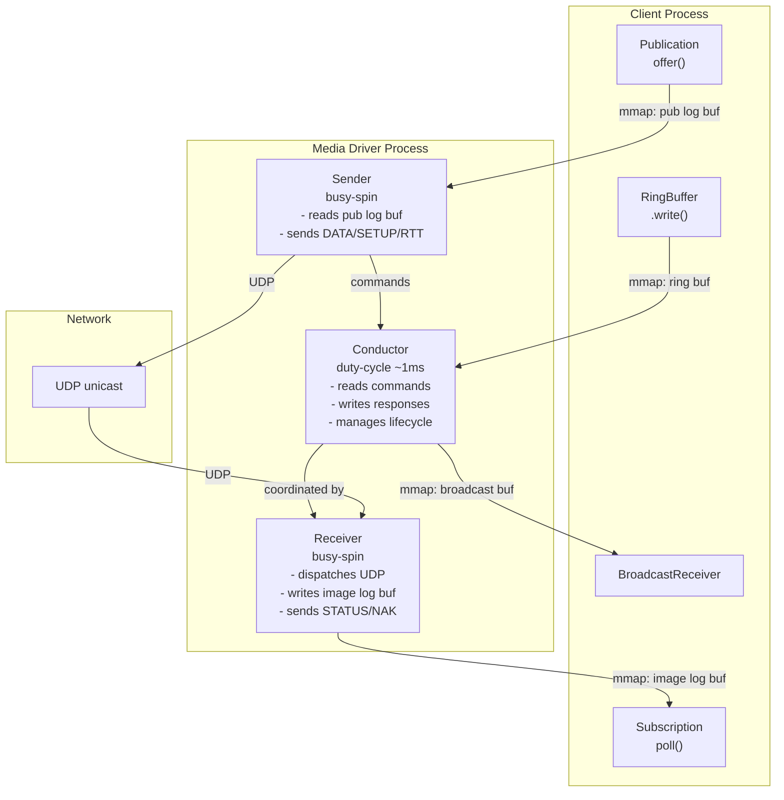
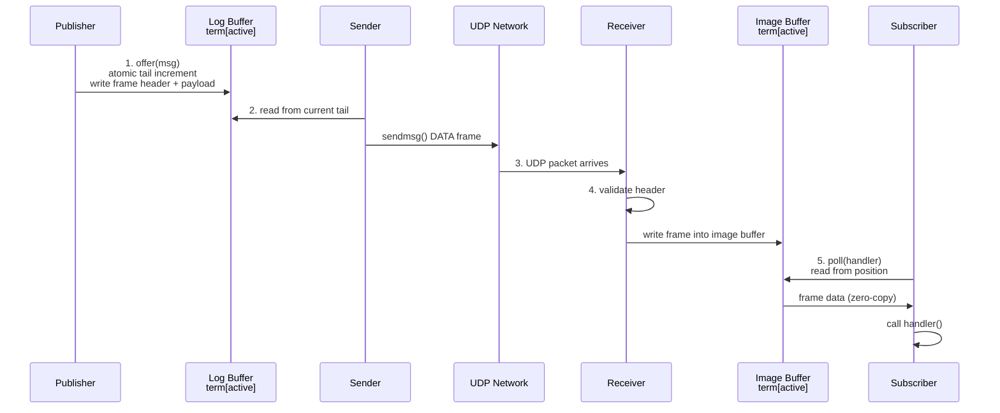

# System Tour

Before writing any code, build a mental model of the whole system. This chapter walks
through every major component, how they are connected, and why the design is the way it is.

!!! abstract "What you'll build"
    A complete mental model of Aeron's architecture:

    - The two-process boundary: client library vs Media Driver
    - Five shared memory regions and their purposes
    - Log buffer structure: terms, tail counters, frame layout
    - Component relationships: Publication, Subscription, Conductor, Sender, Receiver
    - Data flow: from `offer()` through the driver to `poll()`

## The Two Process Boundary

An Aeron deployment has at least two processes: the **Media Driver** and one or more
**client processes** (publishers or subscribers). They communicate through shared memory
regions backed by memory-mapped files in a directory called the `aeron.dir`
(typically `/dev/shm/aeron` on Linux).

The client library never touches a socket. All networking is the driver's responsibility.

!!! info "The Five Shared Memory Regions"
    Every channel between a client and the driver uses one or more of these regions:

    ```
    aeron.dir/
      publications/<session-id>     ← publisher log buffer  (client writes, driver reads)
      images/<session-id>           ← subscriber log buffer (driver writes, client reads)
      cnc.dat                       ← CnC file: ring buffer + broadcast + counters
    ```

    | Region | Direction | Purpose |
    |--------|-----------|---------|
    | Publication log buffer | Client → Driver | Publisher writes frames; Sender reads and transmits |
    | Image log buffer | Driver → Client | Receiver writes incoming frames; Subscriber polls |
    | Ring buffer (in cnc.dat) | Client → Driver | Commands: add publication, add subscription, heartbeat |
    | Broadcast buffer (in cnc.dat) | Driver → Client | Responses: on_publication_ready, on_image_ready, errors |
    | Counters map (in cnc.dat) | Shared | Publisher limit, subscriber position, sender position |

## The Log Buffer in Detail

The log buffer is the heart of Aeron's performance story. It is divided into three equal
partitions called **terms**, indexed 0, 1, and 2. At any point one term is **active**;
the others are clean or being rotated.

```
Log Buffer (e.g. 64 MB total, 3 × ~21 MB)
┌────────────────┬────────────────┬────────────────┬──────────────┐
│   term[0]      │   term[1]      │   term[2]      │  metadata    │
│  (21 MB)       │  (21 MB)       │  (21 MB)       │  (4 KB)      │
└────────────────┴────────────────┴────────────────┴──────────────┘
         ▲ active term
```

The metadata section (at the tail of the file) holds:
- `active_term_count` — which term index is currently active
- `tail_counter[3]` — one atomic 64-bit tail per term (high 32 bits = term ID, low 32 bits = offset)

A publisher atomically increments the tail counter to claim space, then writes the frame
header and payload. If the tail would overflow the term, the publisher triggers a rotation
and the Conductor cleans the old term.

## Component Diagram



## Data Flow: offer() to poll()

A message takes this path from publisher to subscriber:



## Thread Model

The Media Driver runs three long-lived threads:

| Thread | Pattern | Responsibilities |
|--------|---------|-----------------|
| Conductor | Duty-cycle (sleep ~1 ms) | Command processing, resource lifecycle, counter updates |
| Sender | Busy-spin | Read log buffers, transmit DATA/SETUP frames |
| Receiver | Busy-spin | Receive UDP frames, write to image log buffers, send STATUS/NAK |

The Sender and Receiver spin continuously for minimum latency. The Conductor sleeps
between duty cycles because it handles control-plane work that does not need sub-millisecond
response time.

## How the Client Library Talks to the Driver

Commands (client to driver) travel through the **ring buffer** in `cnc.dat`. The ring
buffer is a lock-free many-to-one queue. The client writes a command record (e.g.,
`ADD_PUBLICATION`, `ADD_SUBSCRIPTION`), and the Conductor reads it on its next duty cycle.

Responses (driver to client) travel through the **broadcast buffer**, also in `cnc.dat`.
This is a one-to-many structure: the Conductor writes; all connected clients read their
own copy of the cursor. Responses include `ON_PUBLICATION_READY` (carries the path to the
log buffer file) and `ON_IMAGE_READY` (carries the path to the image log buffer).

When the client receives `ON_PUBLICATION_READY`, it memory-maps the log buffer file and
creates a `Publication` object backed by that mapping. From that point, `offer()` writes
directly to shared memory — no further IPC with the driver on the hot path.

!!! success "What the Next Parts Build"
    - **Part 1** — The primitives: frame codec, ring buffer, broadcast, counters, log buffer.
    - **Part 2** — The data path: TermAppender (write), TermReader (read), frame reassembly.
    - **Part 3** — The driver agents: Sender, Receiver, Conductor, and MediaDriver bootstrap.
    - **Part 4** — The client library: Publication, Subscription, and Aeron context.
