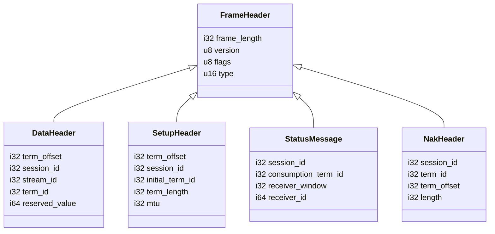
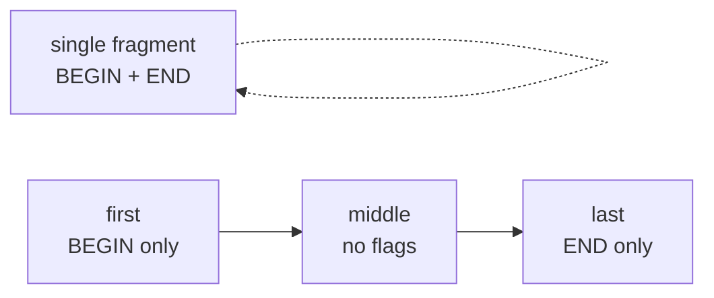

# 1.1 Frame Codec

Aeron moves data as binary frames over UDP. Before anything else — the ring buffer, the log buffer, the driver — you need to understand what a frame looks like on the wire and how the Zig code models it.

> [!NOTE]
> **What you'll build**
> A precise mental model of the Aeron wire frame and the Zig idioms that pin
> its layout to the byte:
>
> - The common 8-byte `FrameHeader` and the frame types that extend it
> - Why wire types are `extern struct` and how `comptime` size asserts guard them
> - The `align(4)` trick that reproduces Aeron's `#pragma pack(4)`
> - The four helper functions the whole data path relies on

## What Is a Frame

Every Aeron UDP datagram is a frame: a fixed-size binary header followed by an optional payload. There is no length-prefixed envelope at the UDP layer; the frame header itself carries `frame_length`. All frames share a common 8-byte base header; most extend it.

```
+--0--+--1--+--2--+--3--+--4--+--5--+--6--+--7--+
|        frame_length (i32)    | ver | flg | type |
+-----+-----+-----+-----+-----+-----+-----+-----+
```

`frame_length` is signed because Aeron sometimes encodes negative values for partially-written frames as a sentinel. `type` is a 16-bit enum (`FrameType`) that tells the receiver how to interpret the rest of the datagram.

Every wire type begins with those same 8 bytes and then adds its own fields:



## Why `extern struct`

Zig's default struct layout may reorder or pad fields freely. For wire formats you need exact field positions matching the Aeron C/Java reference.

> [!NOTE]
> **Zig concept: `extern struct`**
> `extern struct` follows C ABI layout rules: fields are laid out in declaration
> order, with natural alignment padding inserted between them. That makes the
> layout predictable and stable — exactly what a wire format needs.

```zig
pub const FrameHeader = extern struct {
    frame_length: i32,
    version: u8,
    flags: u8,
    type: u16,
};
```

The 8-byte result matches `aeron_frame_header_t` in the C driver exactly.

## Comptime Size Assertions

The codebase relies on a Zig idiom to catch layout bugs at compile time rather than at a crash on the wire:

```zig
comptime {
    std.debug.assert(@sizeOf(FrameHeader) == 8);
}
```

> [!TIP]
> **Fail at build time, not on the wire**
> `@sizeOf` is evaluated at compile time. If a field type or ordering change
> ever breaks the expected size, the build fails immediately — before any test
> runs. Every frame type in `src/protocol/frame.zig` should carry one of these
> assertions.

## Frame Types and Their Layouts

All sizes are in bytes. Offsets are from the start of the frame.

### FrameHeader — 8 bytes

| Offset | Field | Type | Notes |
|--------|-------|------|-------|
| 0 | `frame_length` | i32 | Total byte length of the frame |
| 4 | `version` | u8 | Protocol version (0x00) |
| 5 | `flags` | u8 | Frame-type-specific bitfield |
| 6 | `type` | u16 | `FrameType` enum |

### DataHeader — 32 bytes

Extends `FrameHeader` with Aeron's stream addressing and fragmentation metadata.

| Offset | Field | Type | Notes |
|--------|-------|------|-------|
| 0–7 | base header | — | Same as FrameHeader |
| 8 | `term_offset` | i32 | Byte offset within the term buffer |
| 12 | `session_id` | i32 | Unique per publisher instance |
| 16 | `stream_id` | i32 | Application-level channel stream |
| 20 | `term_id` | i32 | Which term this frame belongs to |
| 24 | `reserved_value` | i64 | Spare; used by cluster for cluster term |

The `flags` field carries fragment state: `BEGIN_FLAG = 0x80`, `END_FLAG = 0x40`, `EOS_FLAG = 0x20`. A single-fragment message has both BEGIN and END set; a multi-fragment message begins with BEGIN only, ends with END only, and has neither in the middle:



### SetupHeader — 40 bytes

Sent by the publisher when it first becomes active and periodically thereafter. Receivers use it to learn the stream geometry.

| Offset | Field | Type | Notes |
|--------|-------|------|-------|
| 0–7 | base header | — | |
| 8 | `term_offset` | i32 | Current tail position |
| 12 | `session_id` | i32 | |
| 16 | `stream_id` | i32 | |
| 20 | `initial_term_id` | i32 | Term count at publication start |
| 24 | `active_term_id` | i32 | Current term |
| 28 | `term_length` | i32 | Size of each term (power of two) |
| 32 | `mtu` | i32 | Max UDP payload used by publisher |
| 36 | `ttl` | i32 | IP TTL for multicast |

### StatusMessage — 36 bytes

Sent by receivers to signal their consumption position and flow-control window.

| Offset | Field | Type | Notes |
|--------|-------|------|-------|
| 0–7 | base header | — | |
| 8 | `session_id` | i32 | |
| 12 | `stream_id` | i32 | |
| 16 | `consumption_term_id` | i32 | Last fully-consumed term |
| 20 | `consumption_term_offset` | i32 | Byte offset within that term |
| 24 | `receiver_window` | i32 | Bytes the receiver can accept |
| 28 | `receiver_id` | i64 align(4) | Unique receiver ID |

> [!WARNING]
> **The `align(4)` is load-bearing**
> Aeron's C header uses `#pragma pack(4)`, placing the 8-byte `receiver_id` at
> offset 28 — **not** 8-aligned. Without the `align(4)` annotation, Zig would
> pad to offset 32 and produce 40 bytes instead of 36, silently breaking wire
> compatibility. The `comptime` size assertion is what catches this.
>
> ```zig
> receiver_id: i64 align(4),
> ```

### NakHeader — 28 bytes

Sent by receivers to request retransmission of a gap.

| Offset | Field | Type | Notes |
|--------|-------|------|-------|
| 0–7 | base header | — | |
| 8 | `session_id` | i32 | |
| 12 | `stream_id` | i32 | |
| 16 | `term_id` | i32 | Term containing the gap |
| 20 | `term_offset` | i32 | Start of the gap |
| 24 | `length` | i32 | Byte length of the gap |

## Helper Functions

`src/protocol/frame.zig` provides four helpers used throughout the data path:

`alignedLength(data_length: usize) usize`
: Returns `(data_length + DataHeader.LENGTH)` rounded up to `FRAME_ALIGNMENT` (32). Ensures every frame in a term buffer starts on a 32-byte boundary, which simplifies tail-pointer arithmetic.

`computeMaxPayload(mtu: usize) usize`
: Returns `mtu - DataHeader.LENGTH`. Publishers call this at setup time to determine the largest single-fragment payload they can send.

`isBeginFragment(flags: u8) bool`
: Tests `flags & DataHeader.BEGIN_FLAG != 0`.

`isEndFragment(flags: u8) bool`
: Tests `flags & DataHeader.END_FLAG != 0`.

Fragment reassembly in the subscriber polls frames until it sees a frame where both `isBeginFragment` and `isEndFragment` are true (single fragment), or a sequence starting with BEGIN and ending with END.

## Key File

`src/protocol/frame.zig` — all frame types, constants (`FRAME_ALIGNMENT = 32`, `VERSION = 0x00`), the `FrameType` enum, and the helper functions.

> [!IMPORTANT]
> **Key takeaways**
> - A frame is a fixed binary header + optional payload; `frame_length` is self-describing, so there is no UDP-level envelope.
> - `extern struct` + a `comptime @sizeOf` assertion pins every wire type to an exact byte layout.
> - `align(4)` reproduces Aeron's `#pragma pack(4)` — omitting it silently corrupts the `StatusMessage` layout.
> - The BEGIN/END flag pair drives fragmentation and reassembly across the whole data path.
