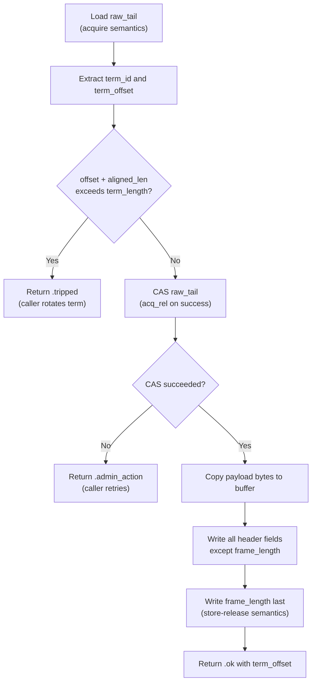

# 2.1 Term Appender

**Source:** `src/logbuffer/term_appender.zig`

!!! abstract "What you'll build"
    A solid mental model of lock-free, thread-safe publication to a shared term buffer using atomic Compare-And-Swap (CAS):

    - The `raw_tail` packing scheme: how a single 64-bit atomic word encodes both `term_id` and `term_offset`
    - The CAS loop in `appendData`: why CAS + retry beats locks, and how to handle `.acq_rel` ordering
    - Frame write ordering: why payload and header go down *before* `frame_length`, written last with a store-release
    - The `AppendResult` union: explicit outcomes at the call site (ok, tripped, admin_action, padding_applied)

## Role

A `TermAppender` owns one of the three term partitions in a `LogBuffer`. Its job is simple: reserve a contiguous region of that partition for a frame, then write into it. Multiple publisher threads may call `appendData` concurrently; correctness comes entirely from a single atomic 64-bit value called `raw_tail`, not from any lock.

The log buffer design is essentially a concurrent ring that never wraps. Each of the three terms is written to exhaustion, then the system rotates to the next. Within a single term, progress is a monotonically increasing offset.

## The raw_tail Packing Scheme

```
raw_tail (i64)
┌──────────────────────┬───────────────────────┐
│   term_id  (hi 32)   │  term_offset (lo 32)  │
└──────────────────────┴───────────────────────┘
```

Both pieces of state are packed into one 64-bit word so that a single CAS atomically claims both the current term identity and a byte range within it. `packTail` and `rawTailVolatile` handle the encoding:

```zig
pub fn packTail(term_id: i32, term_offset: i32) i64 {
    return (@as(i64, term_id) << 32) | @as(i64, @as(u32, @bitCast(term_offset)));
}

pub fn rawTailVolatile(self: *const TermAppender) i64 {
    const ptr: *const i64 = @ptrCast(&self.raw_tail);
    return @atomicLoad(i64, ptr, .acquire);
}
```

!!! info "Zig concept: atomic primitives"
    `@atomicLoad` with `.acquire` ordering ensures that any writes dependent on
    the loaded value happen-after the atomic load. `@cmpxchgStrong` atomically
    compares and exchanges; on success it returns `null`, on failure it returns
    the observed value. The `.acq_rel` ordering pairs with the subscriber's
    `.acquire` load to enforce payload visibility.

## The CAS Loop in appendData

The full sequence inside `appendData`:

```
         ┌──────────────────────────┐
         │ atomicLoad raw_tail      │
         │ extract offset, term_id  │
         └──────────┬───────────────┘
                    │
         ┌──────────▼───────────────┐
         │ offset + aligned_len     │
         │   > term_length?         │
         └──────────┬───────────────┘
              yes   │   no
        ┌───────────┘   └──────────────────────────┐
        ▼                                           ▼
    return .tripped              ┌──────────────────────────┐
                                 │ cmpxchgStrong(raw_tail,  │
                                 │   old, new, .acq_rel)    │
                                 └──────────┬───────────────┘
                                   fail     │   ok
                              ┌────────────┘   └────────────────┐
                              ▼                                  ▼
                     return .admin_action          write payload, then header
                     (caller retries)              return .ok(offset)
```

In Zig, `@cmpxchgStrong` returns `null` on success and the observed value on failure:

```zig
const cas_result = @cmpxchgStrong(i64, ptr, current_raw_tail, new_raw_tail, .acq_rel, .acquire);
if (cas_result != null) {
    return .admin_action; // lost the race — caller must retry
}
```

`.acq_rel` on success pairs with the `.acquire` load at the reader side, providing the happens-before relationship that makes payload bytes visible before the frame length is committed.



!!! tip "Why write frame_length last?"
    The reader polls `frame_length` to detect committed frames. By writing it last,
    a reader sees either 0 (uncommitted) or the complete frame length (committed).
    No partial writes are observable — this is the reader contract.


## Frame Layout in the Term

After winning the CAS, the appender owns the byte range `[offset, offset + aligned_len)`. It writes in this order:

1. Copy the payload bytes into `term_buffer[offset + DataHeader.LENGTH ..]`
2. Write all header fields except `frame_length`
3. Write `frame_length` last with a store-release

`DataHeader` is declared `extern struct` so the compiler places fields exactly as the wire format requires:

```
Offset  Size  Field
0       4     frame_length  (written last)
4       1     version
5       1     flags
6       2     type
8       4     term_offset
12      4     session_id
16      4     stream_id
20      4     term_id
24      8     reserved_value
Total: 32 bytes
```

All frames are padded to `FRAME_ALIGNMENT = 32` bytes so that every frame start is naturally aligned.

## Back-Pressure and Rotation

When `current_offset + aligned_len > term_length`, `appendData` returns `.tripped`. The caller (the publication layer) is responsible for initiating a term rotation — it does not happen inside the appender.

Before leaving the current term, a padding frame is written at the tail via `appendPadding`:

```zig
pub fn appendPadding(self: *TermAppender, _length: i32) AppendResult
```

This CAS-advances `raw_tail` to exactly `term_length` and writes a `FrameType.padding` header covering the remaining bytes. The reader uses this to know it has consumed the entire term and should advance to the next partition.

!!! info "The AppendResult union"
    `AppendResult` is a tagged union that makes every outcome explicit at the
    call site:

    ```zig
    pub const AppendResult = union(enum) {
        ok: i32,          // term_offset where data was written
        tripped,          // term full — rotation needed
        admin_action,     // CAS failure — retry immediately
        padding_applied,  // padding written — retry in next term
    };
    ```

## Function Reference

| Function | Purpose |
|----------|---------|
| `init(buf, term_id)` | Create appender; sets `raw_tail = packTail(term_id, 0)` |
| `packTail(term_id, offset)` | Encode both values into one `i64` |
| `rawTailVolatile()` | Acquire-load `raw_tail` for inspection by the conductor |
| `appendData(header, payload)` | Main CAS-and-write path; returns `AppendResult` |
| `appendPadding(_length)` | Write end-of-term padding frame; triggers rotation |

!!! success "Key takeaways"
    - A single 64-bit atomic word (`raw_tail`) packs both `term_id` and `term_offset`, allowing one CAS to claim both at once.
    - The CAS loop is wait-free: on collision, return `.admin_action` and let the caller retry, never blocking.
    - Payload and header are written before `frame_length`; the reader sees `frame_length == 0` (pending) or positive (committed) — no partial writes.
    - `.acq_rel` ordering on the CAS paired with `.acquire` on the reader load enforces the happens-before relationship.

## Next Step

Proceed to **2.2 Term Reader** (`docs/tutorial/02-data-path/02-term-reader.md`) to see how a subscriber scans the same term buffer from the opposite direction.
