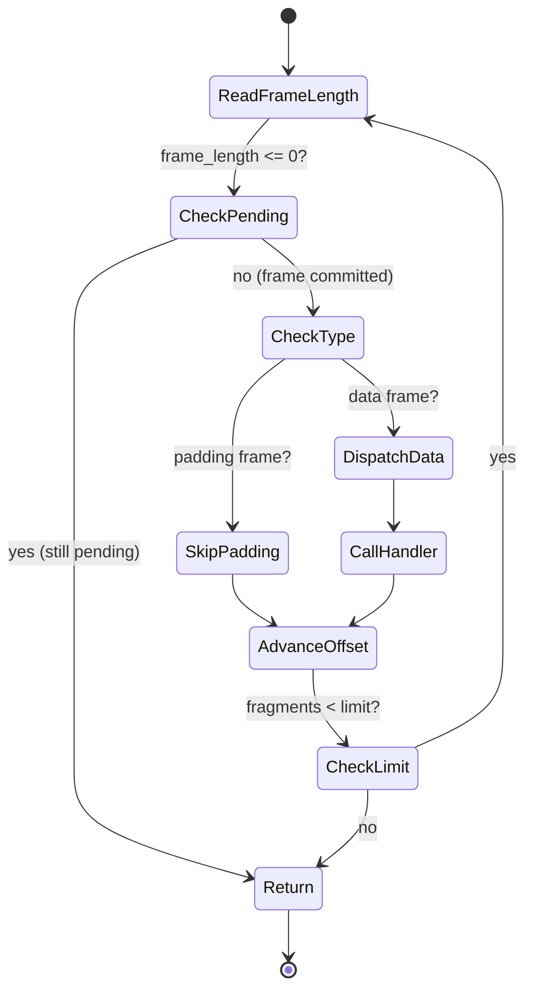

# 2.2 Term Reader

**Source:** `src/logbuffer/term_reader.zig`

!!! abstract "What you'll build"
    A fast, single-pass scan of committed frames in a term buffer:

    - The `FragmentHandler` callback type and the type-erased `*anyopaque` context pattern
    - The poll loop: how to detect committed frames by reading `frame_length` with `.acquire` semantics
    - Fragment flags (BEGIN, END) and why reassembly lives above the reader, not inside it
    - Work budgets via `fragments_limit` to bound poll-cycle latency

## Role

`TermReader` scans a term buffer from a caller-supplied offset, reads committed frames one by one, and invokes a `FragmentHandler` callback for each data frame. It never allocates. It returns a `ReadResult` containing the number of fragments dispatched and the next offset to resume from.

Because the appender writes `frame_length` last, the reader's primary signal is that field: zero means nothing has been committed yet; positive means the frame is complete and safe to read.


## The Fragment Handler Type

```zig
pub const FragmentHandler = *const fn (
    header: *const frame.DataHeader,
    buffer: []const u8,
    ctx: *anyopaque,
) void;
```

!!! info "Zig concept: function pointers and type-erased context"
    `FragmentHandler` is a typed function pointer. The `ctx` parameter carries a
    type-erased context pointer — the Zig equivalent of a closure capture. At the
    call site the caller casts their concrete state pointer to `*anyopaque`;
    inside the callback they cast back with `@ptrCast` + `@alignCast`.

    `@alignCast` is required because `*anyopaque` carries no alignment information;
    `@ptrCast` alone would be a compile error if the target type has an alignment
    requirement greater than 1.

```zig
const handler = struct {
    fn handle(header: *const frame.DataHeader, payload: []const u8, ctx: *anyopaque) void {
        const state = @as(*MyState, @ptrCast(@alignCast(ctx)));
        state.count += 1;
        _ = header; _ = payload;
    }
}.handle;

_ = TermReader.read(term, 0, handler, &my_state, 10);
```


## The Scan Loop

```
         ┌───────────────────────────────────────┐
         │  current_offset = offset              │
         │  fragments_read = 0                   │
         └─────────────────┬─────────────────────┘
                           │
                    ┌──────▼───────┐
              ┌─────┤ fragments <  ├─────┐
              │ no  │  limit?      │ yes │
              ▼     └──────────────┘     ▼
           return                  read frame_length at current_offset
                                        │
                                   <= 0 ┤ positive
                                        ▼
                                   return    compute aligned_len
                                              │
                                         check type
                                              │
                                    padding ──┤── data
                                              │       │
                                          advance   call handler
                                          offset    fragments_read++
                                              │       │
                                              └───┬───┘
                                                  ▼
                                           current_offset += aligned_len
```

The full `read` signature:

```zig
pub fn read(
    term: []const u8,
    offset: i32,
    handler: FragmentHandler,
    ctx: *anyopaque,
    fragments_limit: i32,
) ReadResult
```

`fragments_limit` is a work-budget: the caller (typically the subscription duty cycle) passes a small number like 10 to bound the time spent in a single poll iteration.

Frame length is read with `std.mem.readInt` rather than a pointer cast to remain correct regardless of the platform's native alignment requirements:

```zig
const frame_length = std.mem.readInt(i32, frame_length_bytes[0..4], .little);
```

Similarly, the frame type is read at offset +6 to decide whether to skip (padding) or dispatch (data):

```zig
const frame_type_raw = std.mem.readInt(u16, type_bytes[0..2], .little);
const is_padding = frame_type_raw == @intFromEnum(frame.FrameType.padding);
```

!!! tip "Use std.mem.readInt for unaligned access"
    Reading from arbitrary byte offsets in a buffer risks unaligned access crashes
    on platforms like ARM. `std.mem.readInt` ensures safe, aligned reads.




## Fragment Flags and Reassembly

!!! info "Aeron concept: fragment boundaries"
    `DataHeader.flags` carries three meaningful bits:

    | Constant | Value | Meaning |
    |----------|-------|---------|
    | `BEGIN_FLAG` | `0x80` | First fragment of a message |
    | `END_FLAG` | `0x40` | Last fragment of a message |
    | Both set | `0xC0` | Unfragmented (fits in one frame) |

    A message that fits in a single MTU has both flags set. Larger messages are split
    by the publication layer: the first frame carries `BEGIN_FLAG` only, middle frames
    carry neither, and the last frame carries `END_FLAG`. The subscription layer above
    `TermReader` accumulates slices until it sees `END_FLAG`, then delivers the
    reassembled message to the application.

!!! tip "Reassembly is the caller's responsibility"
    `TermReader` itself does not reassemble — it delivers every fragment to the
    handler individually and trusts the handler (or a wrapper) to manage reassembly
    state. This keeps the reader allocation-free and fast.


## ReadResult

```zig
pub const ReadResult = struct {
    fragments_read: i32,
    offset: i32,
};
```

The returned `offset` is the byte position immediately after the last frame processed. The caller stores this as its subscriber position and passes it back on the next `read` call. If `fragments_read == 0` and `offset == input_offset`, the term has no new data.

## Function Reference

| Symbol | Kind | Purpose |
|--------|------|---------|
| `FragmentHandler` | type alias | Function pointer signature for callbacks |
| `ReadResult` | struct | fragments dispatched + next scan offset |
| `TermReader.read` | fn | Core scan loop; no allocation, no state retained |

!!! success "Key takeaways"
    - A typed function pointer (`FragmentHandler`) with type-erased context (`*anyopaque`) is the standard Zig pattern for stateful callbacks.
    - Frame length is read with `.acquire` semantics; a zero or negative value means the frame is still being written by the appender.
    - `std.mem.readInt` ensures safe, alignment-agnostic reads from arbitrary buffer offsets.
    - Reassembly (combining fragments into complete messages) happens in the subscription layer above the reader, keeping the reader allocation-free.

## Next Step

Proceed to **2.3 UDP Transport** (`docs/tutorial/02-data-path/03-udp-transport.md`) to see how frames leave the term buffer and travel over the network.
