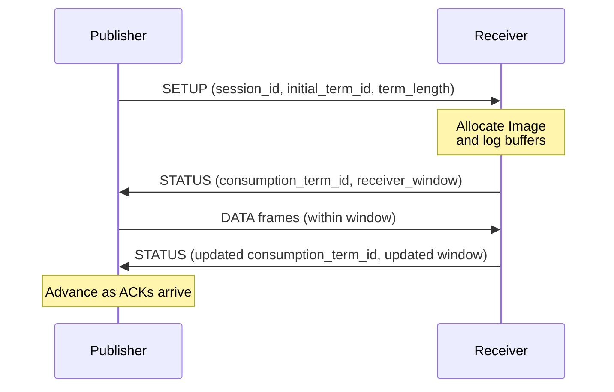

# 2.3 UDP Transport

!!! abstract "What you'll build"
    Understanding of how Aeron layers reliability and ordering over unreliable UDP:

    - Non-blocking socket fundamentals and why Aeron's media driver never blocks
    - Multicast group join and the critical role of the `interface` parameter
    - The SETUP/STATUS handshake that bootstraps sender-receiver agreement
    - NAK-driven retransmission and flow control windows
    - URI parsing and the distinction between unicast and multicast endpoints

!!! info "Aeron concept: reliability over UDP"
    UDP is "fire and forget" — packets can be lost, reordered, or duplicated. Aeron
    needs a way to turn this chaotic stream into a reliable, ordered sequence of
    messages while maintaining the low-latency benefits of UDP. It does this through
    sequence numbering (term IDs and offsets), flow control windows, and NAK-driven
    retransmission.

## Zig Track: The `std.posix` Socket API

In Zig, network programming is explicit and close to the OS. We don't use a high-level "Socket" class with hidden state; we use raw file descriptors and syscall wrappers.

### Non-blocking Sockets

Aeron's media driver never blocks on I/O. Every socket is opened with the `SOCK.NONBLOCK` flag.

```zig
// LESSON(transport/zig): SOCK_NONBLOCK avoids a separate fcntl() call.
const sock = try std.posix.socket(
    family,
    std.posix.SOCK.DGRAM | std.posix.SOCK.NONBLOCK,
    std.posix.IPPROTO.UDP,
);
```

!!! tip "Non-blocking I/O by default"
    On Linux, `SOCK_NONBLOCK` sets the flag atomically during socket creation. On
    macOS, Zig's `std.posix` helper transparently handles the `FIONBIO` ioctl. When
    a non-blocking `recvfrom` has no data, it returns `error.WouldBlock`, never
    blocking the driver thread.

### Multicast Group Join

Receiving multicast requires telling the OS which group we want to join. This involves the `IP_ADD_MEMBERSHIP` socket option.

```zig
const mreq = IpMreq{
    .imr_multiaddr = group.in.sa.addr,
    .imr_interface = interface_addr.in.sa.addr,
};
try std.posix.setsockopt(self.socket, std.posix.IPPROTO.IP, IP_ADD_MEMBERSHIP, &std.mem.toBytes(mreq));
```

!!! warning "The interface parameter is critical"
    The `imr_interface` field tells the OS which physical network card to use for
    the multicast group join. Without it or with the wrong address, packets will
    not arrive. The `harus-aeron-zig` transport layer validates this at configuration
    time to catch errors early.

Because these constants and structs vary by operating system, `harus-aeron-zig` defines them in `src/transport/endpoint.zig` to ensure cross-platform compatibility where `std.posix` might be missing them.


## Aeron Track: Handshakes and Flow Control

Aeron doesn't use TCP-style connections, but it still needs to establish state between a sender and a receiver.

### The SETUP/STATUS Handshake

When a publication starts sending, it periodically broadcasts a **SETUP** frame. This frame contains the `session_id`, `initial_term_id`, and `term_length`.



1. **Sender** sends SETUP until it receives a STATUS frame.
2. **Receiver** sees the SETUP, allocates a local **Image** (including log buffers), and starts sending **STATUS** frames back.
3. **STATUS** frames contain the `receiver_window_address` — this tells the sender how much data it is allowed to send before hitting back-pressure.

### NAK Retransmit Flow

If the receiver detects a gap in the sequence numbers (term offsets), it doesn't immediately ask for a retransmit. It waits for a short duration (default 1ms) to allow for out-of-order packets to arrive.

If the gap persists, it sends a **NAK** (Negative Acknowledgement) frame. The sender, upon receiving a NAK, scans its log buffer and re-sends the missing range of data.

!!! info "Flow control via receiver window"
    The receiver window bounds the sender — it prevents the sender from flooding
    the receiver with data faster than it can be consumed. The window is expressed
    as a byte count and is updated in every STATUS frame as the receiver advances.

### Unicast vs Multicast URIs

Aeron URIs encode the transport configuration:

- **Unicast**: `aeron:udp?endpoint=192.168.1.10:40123`
- **Multicast**: `aeron:udp?endpoint=224.0.1.1:40456|interface=192.168.1.20`

The driver automatically detects multicast by checking if the endpoint address is in the `224.0.0.0/4` range. For multicast, the `interface` parameter is critical — it tells the OS which physical network card to use for the group join.


## Implementation Walkthrough

!!! info "Module breakdown"
    - **`src/transport/uri.zig`**: Parses the `aeron:udp?...` string into key-value pairs.
    - **`src/transport/udp_channel.zig`**: Resolves hostnames and determines if the channel is multicast.
    - **`src/transport/endpoint.zig`**: Manages the lifecycle of the `std.posix` socket.
    - **`src/transport/poller.zig`**: Uses `std.posix.poll` to multiplex many receive endpoints in a single duty cycle.

!!! question "Exercise"
    1. Open `src/transport/udp_channel.zig` and implement the `isMulticastAddress` helper to detect multicast addresses in the `224.0.0.0/4` range.
    2. Verify with `make check`.

    - [ ] Function detects multicast addresses correctly
    - [ ] Unicast addresses (e.g., `192.168.1.10`) return false
    - [ ] Multicast addresses (e.g., `224.0.1.1`) return true

!!! success "Key takeaways"
    - Non-blocking sockets and `error.WouldBlock` handling let the media driver poll many endpoints in one pass without blocking.
    - The SETUP/STATUS handshake establishes receiver state (Image) and receiver window bounds.
    - NAK-driven retransmission closes gaps in the ordered sequence, turning UDP chaos into reliable delivery.
    - Multicast requires careful configuration of the interface parameter; unicast is simpler but one-to-one.

## Further Reading

- [Aeron UDP Protocol](https://github.com/aeron-io/aeron/wiki/Protocol-Specification)
- Compare against `src/transport/*.zig` for implementation details
