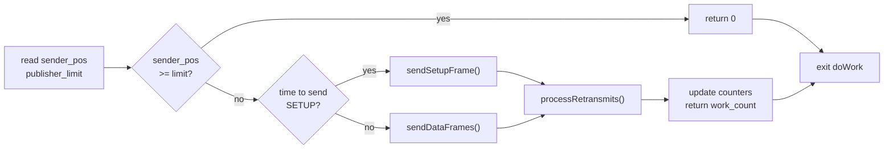

# 3.1 The Sender

The Sender is a duty-cycle agent: once per scheduler tick it wakes up, scans every active publication, drains frames from the log buffer into UDP datagrams, and goes back to sleep. It never blocks on I/O. It has no locks. It does not read from the network.

!!! abstract "What you'll build"
    A precise mental model of how the Sender continuously drains the publisher's log buffer to the network:

    - The lifecycle of a `NetworkPublication` — session, stream, address, and term buffers
    - How `sender_position` and `publisher_limit` counters track the send window
    - The four-step duty cycle: check window, send SETUP, drain DATA, process retransmits
    - Why the busy-spin pattern achieves ultra-low latency

## NetworkPublication

`NetworkPublication` is the Sender's view of one active stream. It holds everything needed to drain and transmit frames:

```zig
pub const NetworkPublication = struct {
    session_id: i32,
    stream_id: i32,
    initial_term_id: i32,
    log_buffer: *logbuffer.LogBuffer,
    sender_position: counters.CounterHandle,  // how far the sender has read
    publisher_limit: counters.CounterHandle,  // how far the client has written
    send_channel: *endpoint.SendChannelEndpoint,
    dest_address: std.net.Address,
    mtu: i32,
    last_setup_time_ms: i64,
};
```

!!! info "Aeron concept: sender position and publisher limit"
    `sender_position` and `publisher_limit` are indices into a shared counter array — a
    memory-mapped slab visible to both the media driver and the client library. The client
    advances `publisher_limit` as it writes frames; the Sender advances `sender_position` as
    it reads and transmits them. The range `[sender_pos, pub_limit)` is the live window of
    bytes that have been committed but not yet sent.

## The doWork Loop

```zig
pub fn doWork(self: *Sender) i32 {
    var work_count: i32 = 0;
    for (self.publications.items) |publication| {
        work_count += self.processPublication(publication);
    }
    work_count += self.processRetransmits();
    return work_count;
}
```

`doWork` returns the number of work items completed. Returning 0 signals to the outer busy-spin that the system is idle and the thread may yield. A non-zero return means "I did something — call me again immediately."

### The Sender Duty Cycle



### Inside processPublication

For each publication, the Sender:

1. Reads `sender_position` and `publisher_limit` from shared counters
2. If nothing to send (`sender_pos >= pub_limit`), moves to the next publication
3. Periodically (every 50 ms) transmits a SETUP frame with stream geometry
4. Drains all committed DATA frames from `sender_pos` to `pub_limit`, scanning in frame-aligned steps

The range `[sender_pos, pub_limit)` is the window of bytes that have been committed by the client but not yet placed on the wire.

## DATA Frame Transmission

`sendDataFrames` reads raw bytes out of the active term buffer at the current offset, checks the `frame_length` field (a little-endian `i32` at offset 0), aligns it to `FRAME_ALIGNMENT` (32 bytes), and calls `send_channel.send`. The data is already in Aeron wire format — no serialization step is needed.

```
term_offset = sender_pos % term_length
frame_length = readInt(i32, term_buffer[term_offset..], .little)
aligned_len  = roundUp(frame_length, FRAME_ALIGNMENT)
send(dest_address, term_buffer[term_offset..term_offset+aligned_len])
sender_pos  += aligned_len
```

After all frames in the window are sent, the counter is updated atomically:

```zig
if (current_pos > sender_pos) {
    self.counters_map.set(publication.sender_position.counter_id, current_pos);
}
```

## SETUP Frames

A `SETUP` frame carries stream geometry — `session_id`, `stream_id`, `initial_term_id`, `term_length`, `mtu` — so that a receiver can allocate the correct log buffer before any `DATA` arrives. The Sender retransmits `SETUP` every 50 ms for the lifetime of the publication, ensuring late-joining subscribers can synchronise.

```zig
header.type          = @intFromEnum(protocol.FrameType.setup);
header.initial_term_id = publication.initial_term_id;
header.active_term_id  = current_term_id;
header.term_length     = publication.log_buffer.term_length;
header.mtu             = publication.mtu;
```

!!! tip "Late-joining subscribers benefit from periodic SETUP"
    Because a receiver may start listening at any time, the Sender continues to broadcast
    SETUP frames throughout the publication's lifetime. This allows new subscribers to
    learn the stream geometry without waiting for a client-side timeout.

## The Retransmit Queue

When a receiver detects a gap, it sends a `NAK` frame. The `Receiver` agent decodes the `NAK` and calls `sender.onRetransmit(session_id, stream_id, term_id, term_offset, length)`, which appends a `RetransmitRequest` to the queue:

```zig
pub const RetransmitRequest = struct {
    session_id: i32,
    stream_id:  i32,
    term_id:    i32,
    term_offset: i32,
    length:     i32,
    timestamp_ms: i64,
};
```

`processRetransmits` drains this queue each duty cycle. It locates the matching publication, reads the requested bytes from the correct term buffer, and sends them. Stale entries (older than the retransmit timeout) are discarded without sending.

## Managing Publications

```zig
pub fn onAddPublication(self: *Sender, publication: *NetworkPublication) void
pub fn onRemovePublication(self: *Sender, session_id: i32, stream_id: i32) void
```

The `Conductor` calls these when clients register or deregister streams. `onRemovePublication` uses `swapRemove` — O(1) deletion that does not preserve order, acceptable because the list is iterated in full each cycle.

## The Busy-Spin Pattern in Zig

In standalone mode the Sender runs on its own OS thread:

```zig
fn senderThreadFunc(md: *MediaDriver) void {
    while (md.running.load(.acquire)) {
        _ = md.sender_agent.doWork();
    }
}
```

This is a pure busy-spin: no sleep, no condition variable, no epoll. Aeron's design trades CPU for latency. On production deployments the thread is pinned to an isolated core with `pthread_setaffinity_np`. The `running` flag is a `std.atomic.Value(bool)`, ensuring the stop signal crosses the memory model boundary correctly.

!!! warning "Busy-spin uses one full core"
    The Sender thread will consume 100% CPU in steady state. Production deployments isolate this
    thread to its own dedicated core to prevent it from interfering with application workloads.
    For development and testing, this is acceptable; just be aware when profiling or monitoring.

## Key File

`src/driver/sender.zig` — the complete Sender implementation.

Compare against the Java reference: [`sender.go`](https://github.com/aeron-io/aeron/blob/master/aeron-driver/src/main/java/io/aeron/driver/Sender.java).

## Function Reference

| Function | Purpose |
|---|---|
| `init` | Allocate `publications` and `retransmit_queue` ArrayLists |
| `deinit` | Free both lists |
| `doWork` | Outer duty cycle; returns work count |
| `processPublication` | Per-publication: check window, send SETUP, drain DATA |
| `sendSetupFrame` | Build and transmit a SETUP header |
| `sendDataFrames` | Walk term buffer window, transmit aligned frames |
| `processRetransmits` | Drain retransmit queue |
| `onAddPublication` | Append publication to active list |
| `onRemovePublication` | Remove publication by (session, stream) |
| `onRetransmit` | Enqueue a NAK-requested retransmit |

!!! success "Key takeaways"
    - The Sender is a pure duty-cycle agent: no blocking I/O, no locks, no network reads.
    - `sender_position` and `publisher_limit` counters define the live window of data to send.
    - Each duty cycle: check window → send periodic SETUP → drain DATA frames → process retransmits.
    - The busy-spin pattern sacrifices CPU for microsecond-scale latency.

Next, we'll examine the Receiver — the mirror-image agent that decodes incoming UDP frames and detects gaps in the sequence.
