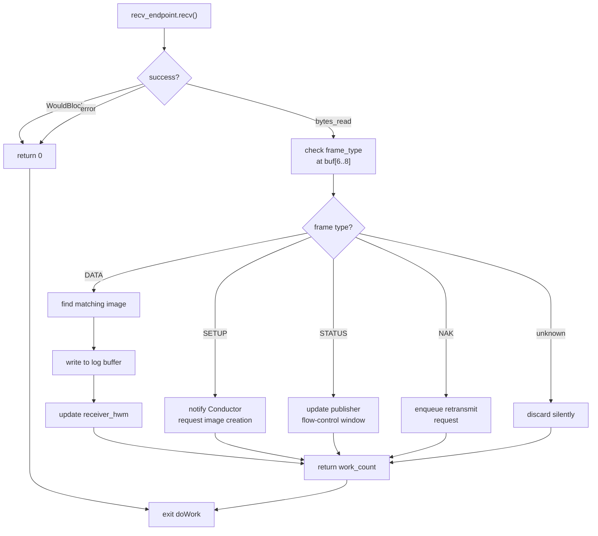

# 3.2 The Receiver

The Receiver is the inbound counterpart to the Sender. It polls a UDP socket once per duty cycle, routes the arriving frame to the correct subscription image, and issues protocol responses (`StatusMessage`, `NAK`) to keep the flow-control loop running.

> [!NOTE]
> **What you'll build**
> A precise mental model of the Receiver's frame-dispatch and flow-control path:
>
> - The `Image` struct — the Receiver's view of one publisher's stream
> - How `subscriber_position` and `receiver_hwm` counters track consumption and arrival
> - The receive duty cycle: poll socket → validate header → dispatch frame → handle gaps
> - Why untrusted external data requires defensive error handling
> - How `StatusMessage` and `NAK` frames drive flow control and retransmission

## The Image

An `Image` represents one publisher's stream as seen by a subscriber:

```zig
pub const Image = struct {
    session_id:        i32,
    stream_id:         i32,
    initial_term_id:   i32,
    term_length:       usize,
    log_buffer:        *logbuffer.LogBuffer,
    subscriber_position: counters.CounterHandle, // highest consumed offset
    receiver_hwm:        counters.CounterHandle, // highest received offset
    rebuild_position:    i64,
    source_address:      std.net.Address,
};
```

> [!NOTE]
> **Aeron concept: receiver tracking**
> `subscriber_position` is the highest byte offset that the application has consumed.
> `receiver_hwm` (high-water mark) is the highest byte offset that has arrived from the wire.
> The gap `receiver_hwm - rebuild_position` indicates missing data; any gap triggers NAK.

## Frame Dispatch

The Receiver's duty cycle polls the socket and dispatches frames:



The actual dispatch in `doWork`:

```zig
const frame_type_raw = std.mem.readInt(u16, self.recv_buf[6..8], .little);

if (frame_type_raw == @intFromEnum(protocol.FrameType.data)) {
    const header = @as(*const protocol.DataHeader, @ptrCast(@alignCast(&self.recv_buf[0])));
    // find matching image, write payload
}
```

## Writing DATA to the Log Buffer

On a `DATA` frame match, the receiver extracts the payload and writes it at `term_offset` inside the active partition of the image's log buffer. It then bumps `receiver_hwm` if the new high-water mark exceeds the previous one:

```
payload = recv_buf[DataHeader.LENGTH .. frame_length]
copy payload → log_buffer.termBuffer(active_partition)[term_offset..]
new_hwm = initial_term_id_offset + term_offset + payload.len
if new_hwm > counters.get(receiver_hwm):
    counters.set(receiver_hwm, new_hwm)
```

## Flow Control: The Receiver Window

The receiver window is the amount of unconsumed buffer the subscriber can accept. The `StatusMessage` frame advertises this to the publisher so it can advance `publisher_limit`:

```zig
pub fn sendStatus(self: *Receiver, image: *Image) !void {
    const subscriber_pos = self.counters_map.get(image.subscriber_position.counter_id);
    // ...
    status.receiver_window = @as(i32, @divTrunc(image.term_length, 4));
    status.consumption_term_id     = consumption_term_id;
    status.consumption_term_offset = consumption_term_offset;
    _ = try self.send_endpoint.send(image.source_address, status_bytes);
}
```

The window here is fixed at `term_length / 4`. Production Aeron computes it dynamically based on consumption rate; this implementation uses a conservative static value.

```
Publisher                         Receiver
   │                                  │
   │──── DATA frames ────────────────>│  receiver_hwm advances
   │                                  │  application reads → subscriber_pos advances
   │<─── StatusMessage (window=W) ───│  publisher_limit = subscriber_pos + W
   │──── DATA frames (up to limit) ─>│
```

## Gap Detection and NAK

If `rebuild_position < receiver_hwm`, there is a hole in the received sequence. The receiver sends a `NAK` naming the term and offset of the gap:

```zig
pub fn sendNak(self: *Receiver, image: *Image) !void {
    nak_header.term_id     = image.initial_term_id + @as(i32, @intCast(
        image.rebuild_position / @as(i64, @intCast(image.term_length))));
    nak_header.term_offset = image.gapTermOffset();
    nak_header.length      = 4096;
    _ = try self.send_endpoint.send(image.source_address, nak_bytes);
}
```

The sender responds by re-queuing the named range for retransmission.

## Error Handling: Defensive UDP Reception

> [!WARNING]
> **The receive path handles untrusted external data**
> The socket delivers bytes from arbitrary UDP sources on the network. Any field could be
> truncated, malformed, or malicious. The Receiver must never panic, crash, or expose
> undefined behavior. Following the project rule: **no `unreachable` in UDP receive paths**.

The Receiver uses Zig's `!T` error union returns throughout, and the `doWork` caller degrades gracefully rather than panicking:

```zig
const bytes_read = self.recv_endpoint.recv(&self.recv_buf, &src_addr) catch |err| {
    if (err == error.WouldBlock) { return 0; }
    return 0;  // log or count, but never crash
};
if (bytes_read < 8) { return 0; }  // guard every size assumption
```

A bad magic byte, a truncated header, or an unrecognised frame type all result in a silent drop and a return to the poll loop. The project also enforces this in `frame.zig` — every decode function returns `error.InvalidFrame` rather than calling `unreachable`.

### errdefer for Cleanup

When allocating resources during image setup, `errdefer` ensures partial allocations are released if a later step fails:

```zig
const channel_copy = try allocator.dupe(u8, channel);
errdefer allocator.free(channel_copy);
const log_buf = try logbuffer.LogBuffer.init(allocator, term_length);
errdefer log_buf.deinit();
// if anything below fails, both are freed automatically
```

## Managing Images

```zig
pub fn onAddSubscription(self: *Receiver, image: *Image) !void
pub fn onRemoveSubscription(self: *Receiver, session_id: i32, stream_id: i32) void
```

The Conductor calls these as subscribers are added or removed. The image list is scanned linearly on each received frame — acceptable for small subscriber counts, and consistent with the zero-allocation hot path.

## Key File

`src/driver/receiver.zig` — the complete Receiver implementation.

Compare against the Java reference: [`receiver.go`](https://github.com/aeron-io/aeron/blob/master/aeron-driver/src/main/java/io/aeron/driver/Receiver.java).

## Function Reference

| Function | Purpose |
|---|---|
| `init` | Allocate image list, zero recv_buf |
| `deinit` | Free image list |
| `doWork` | Poll socket, dispatch one frame |
| `sendStatus` | Transmit StatusMessage with receiver window |
| `sendNak` | Transmit NAK for a detected gap |
| `onAddSubscription` | Append image to active list |
| `onRemoveSubscription` | Remove image by (session, stream) |
| `Image.hasGap` | True if rebuild_position < receiver_hwm |
| `Image.gapTermOffset` | Term-relative offset of the gap start |

> [!IMPORTANT]
> **Key takeaways**
> - The Receiver is a pure polling agent: it wakes once per duty cycle, reads one UDP datagram, and returns.
> - Each frame is routed to the correct `Image` by matching `session_id` and `stream_id`.
> - `subscriber_position` and `receiver_hwm` counters drive gap detection and NAK generation.
> - Untrusted external data requires defensive handling: no panics, no `unreachable`, graceful degradation.
> - `StatusMessage` and `NAK` frames form the flow-control feedback loop to the publisher.

Next, we'll examine the Conductor — the brain that orchestrates the Sender and Receiver by managing publications, subscriptions, and inter-process communication through shared memory.
