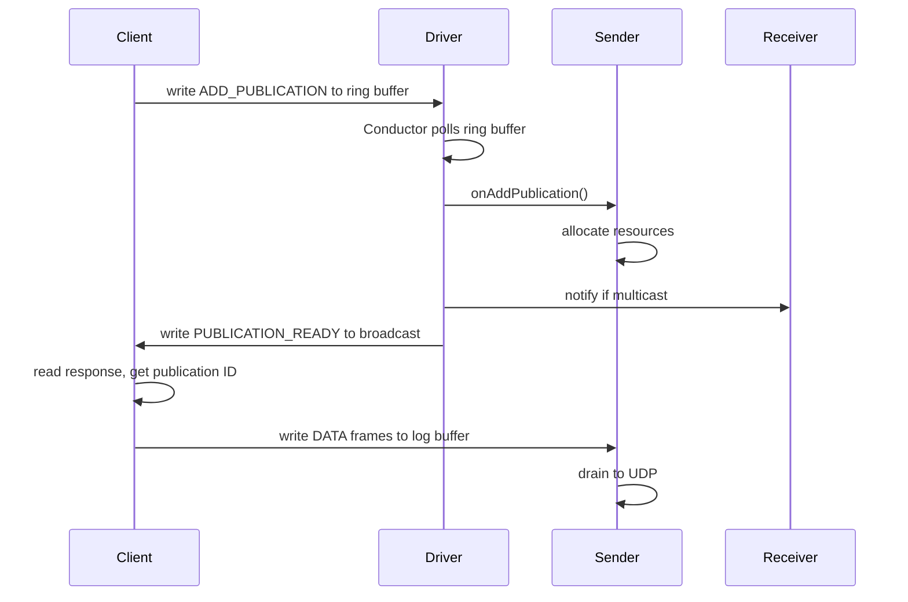

# 3.3 The Conductor and CnC.dat

The Conductor is the "brain" of the Media Driver. It doesn't touch the data path (sending or receiving packets); instead, it manages the lifecycle of resources and coordinates between clients and the other driver agents.

> [!NOTE]
> **What you'll build**
> A precise mental model of the Conductor's role as the control-plane orchestrator:
>
> - How processes discover and synchronize via shared memory and `CnC.dat`
> - The four shared buffers: to-driver ring buffer, to-clients broadcast buffer, counters metadata, counters values
> - How the Conductor polls commands, dispatches them, and signals responses via broadcast
> - Client discovery, keepalive, and resource cleanup on client timeout

## The Coordination Problem

How do multiple independent processes (the Driver and many Clients) coordinate without a central broker or heavy RPC? How does a client "connect" to a driver that might have started at any time? Aeron's answer: **shared memory**.



## Shared Memory via `mmap`

Aeron uses the file system as a rendezvous point. Processes communicate by mapping the same file into their respective virtual address spaces.

### Zig: The `std.posix.mmap` API

In Zig, we use `std.posix.mmap` to request the OS to map a file descriptor to a memory address.

```zig
// LESSON(conductor/zig): We mmap a file and cast a pointer to our header struct.
const ptr = try std.posix.mmap(
    null,
    total_size,
    std.posix.PROT.READ | std.posix.PROT.WRITE,
    .{ .TYPE = .SHARED },
    file.handle,
    0,
);
const mapped = @as([*]align(std.heap.page_size_min) u8, @ptrCast(ptr))[0..total_size];
```

> [!TIP]
> **`.TYPE = .SHARED` ensures inter-process visibility**
> The `.TYPE = .SHARED` flag is critical: it ensures that writes to this memory are
> visible to other processes mapping the same file. Without it, the memory would be
> private to the process and changes would not propagate.

### Pointer Arithmetic in Mapped Memory

Once mapped, we treat the file as a large byte array. We use offsets to locate specific buffers (ring buffers, broadcast buffers, counters) within the single `CnC.dat` file.

```zig
pub fn toDriverBuffer(self: *CncFile) []u8 {
    const len = @as(usize, @intCast(self.toDriverBufferLength()));
    return self.mapped[CNC_HEADER_SIZE..][0..len];
}
```

Zig's slice syntax `mapped[start..][0..len]` provides a safe way to create views into the shared memory without manual pointer incrementing.

## Aeron Protocol: Driver Discovery and Resource Lifecycle

### CnC.dat: The Command and Control File

The `CnC.dat` file is the first thing an Aeron client looks for. It lives in the `aeron.dir` (often `/dev/shm/aeron` on Linux for maximum speed).

The file contains:
1. **The Header**: Version, magic number, and lengths of all following buffers.
2. **To-Driver Ring Buffer**: Clients write commands here (e.g., "Add Publication").
3. **To-Clients Broadcast Buffer**: Driver writes events here (e.g., "Publication Ready").
4. **Counters Metadata & Values**: Shared statistics and positions.

### Client Handshake

When you call `Aeron.connect()`, the client:
1. Finds `CnC.dat` in the configured directory.
2. Maps it into memory.
3. Reads the versions to ensure compatibility.
4. Starts a "Keepalive" heartbeat so the driver knows the client is still alive.

### Resource Lifecycle

The Conductor manages the lifecycle of Publications and Subscriptions.

> [!NOTE]
> **Publication lifecycle**
> When a client asks for a **Publication**, the Conductor allocates a new `session_id`, creates
> the log buffer files on disk, and notifies the client via the broadcast buffer. If a client
> crashes, its keepalive will stop. The Conductor detects this and eventually cleans up the
> associated resources (closing log buffers, reclaiming session IDs).

## Key Files

- **`src/driver/cnc.zig`** — driver-side creation and layout of the `CnC.dat` file
- **`src/cnc.zig`** — client-side mapping and reading of `CnC.dat`
- **`src/driver/conductor.zig`** — the main agent loop; polls the `to-driver` ring buffer for commands and dispatches them

Compare against the Java reference: [`DriverConductor.java`](https://github.com/aeron-io/aeron/blob/master/aeron-driver/src/main/java/io/aeron/driver/DriverConductor.java).

> [!NOTE]
> **Exercise**
> 1. Open `src/driver/conductor.zig` and review the `handleMessage` dispatcher.
> 2. Verify that the conductor can process an `ADD_PUBLICATION` command.
> 3. Trace how the publication is passed to the Sender via `onAddPublication()`.

> [!IMPORTANT]
> **Key takeaways**
> - The Conductor is the control-plane orchestrator: it manages resource lifecycle, not the data path.
> - Multi-process coordination is achieved through shared memory (mmap) and a `CnC.dat` file.
> - The four shared buffers (ring, broadcast, counters-meta, counters-values) form the IPC protocol.
> - The Conductor polls the to-driver ring buffer for commands and responds via broadcast.
> - Client discovery and keepalive ensure graceful cleanup on process death.

Next, we'll assemble all three agents (Conductor, Sender, Receiver) into the `MediaDriver` and explore how they coordinate in embedded and standalone modes.
