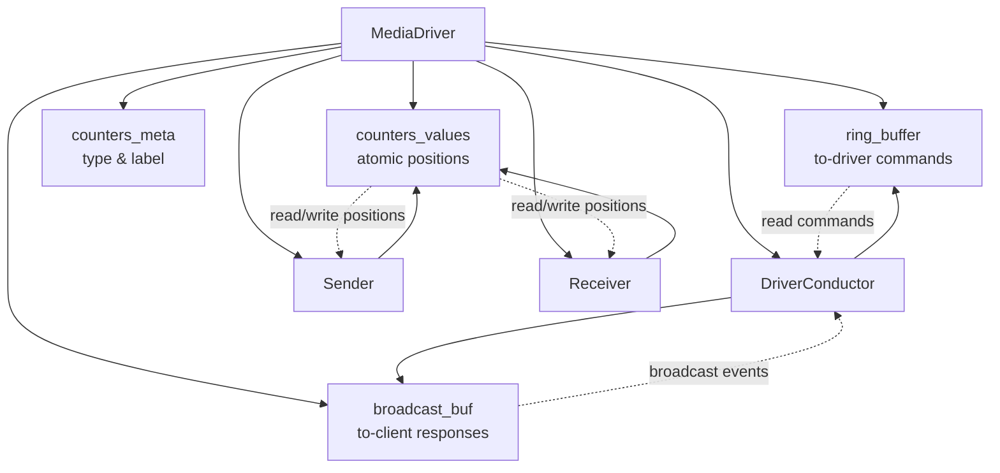

# 3.4 The Media Driver

The `MediaDriver` is the top-level orchestrator. It owns a `DriverConductor`, a `Sender`, and a `Receiver`, plus all shared buffers and endpoints. It can run in two modes: **standalone** (one OS thread per agent) and **embedded** (all three agents driven synchronously by a single `doWork` call).

!!! abstract "What you'll build"
    A precise mental model of how the three agents and shared buffers come together:

    - The `MediaDriverContext` configuration and its defaults
    - The `MediaDriver` struct: agents, buffers, IPC primitives, and thread fields
    - The `init` function: wiring everything together and guarding with `errdefer`
    - Embedded mode: synchronous testing without threads or sockets
    - Standalone mode: three OS threads in busy-spin loops with atomic coordination
    - Graceful shutdown via atomic `running` flag and thread join

## MediaDriverContext

All tunable parameters live in `MediaDriverContext`, with sensible defaults:

```zig
pub const MediaDriverContext = struct {
    aeron_dir: []const u8 = "/dev/shm/aeron",
    term_buffer_length:            i32  = 16 * 1024 * 1024,
    ipc_term_buffer_length:        i32  = 64 * 1024,
    mtu_length:                    i32  = 1408,
    client_liveness_timeout_ns:    i64  = 5_000_000_000,
    publication_connection_timeout_ns: i64 = 5_000_000_000,
};
```

Callers pass a context struct to `init`. Because Zig allows struct literals with partial field initialisation, overriding a single field is clean:

```zig
var md = try MediaDriver.init(allocator, .{ .mtu_length = 8192 });
```

!!! tip "Zig struct literal defaults are elegant"
    By defining sensible defaults in the struct and accepting partial field initialization,
    Zig allows callers to override only the fields they care about. No builder pattern needed.

## MediaDriver Fields

```zig
pub const MediaDriver = struct {
    allocator:       std.mem.Allocator,
    ctx:             MediaDriverContext,
    conductor_agent: DriverConductor,
    sender_agent:    Sender,
    receiver_agent:  Receiver,
    running:         std.atomic.Value(bool),
    conductor_thread: ?std.Thread,
    sender_thread:    ?std.Thread,
    receiver_thread:  ?std.Thread,

    // Shared IPC buffers
    ring_buffer_buf:     []u8,
    broadcast_buf:       []u8,
    counters_meta_buf:   []u8,
    counters_values_buf: []u8,

    ring_buf:       ManyToOneRingBuffer,
    broadcaster:    BroadcastTransmitter,
    counters_map:   CountersMap,

    recv_endpoint: ReceiveChannelEndpoint,
    send_endpoint: SendChannelEndpoint,
};
```

The three thread fields are `?std.Thread` — optional types that are `null` until `start` is called. This makes `deinit` safe in both modes: a `null` thread is simply skipped.

### Shared Buffer Architecture



## init: Wiring Everything Together

`init` allocates the four shared buffers, constructs the IPC primitives (`ManyToOneRingBuffer`, `BroadcastTransmitter`, `CountersMap`), opens the UDP socket, and finally constructs the three agents with references to the shared primitives:

```
allocate ring_buffer_buf  (4 KB)
allocate broadcast_buf    (8 KB)
allocate counters_meta_buf + counters_values_buf

ring_buf     = ManyToOneRingBuffer.init(ring_buffer_buf)
broadcaster  = BroadcastTransmitter.init(allocator, broadcast_buf)
counters_map = CountersMap.init(meta, values)

conductor_agent = DriverConductor.init(allocator, &ring_buf, &broadcaster, &counters_map)
sender_agent    = Sender.init(allocator, &send_endpoint, &counters_map)
receiver_agent  = Receiver.init(allocator, &recv_endpoint, &send_endpoint, &counters_map)
```

`errdefer` guards each allocation so partial failures clean up correctly.

## Embedded Mode

```zig
pub fn doWork(self: *MediaDriver) i32 {
    var work_count: i32 = 0;
    work_count += self.conductor_agent.doWork();
    work_count += self.sender_agent.doWork();
    work_count += self.receiver_agent.doWork();
    return work_count;
}
```

In embedded mode there are no threads. The caller drives the entire driver by calling `doWork` in a loop. This is the primary test harness pattern:

```zig
var md = try MediaDriver.init(testing.allocator, .{});
defer md.deinit();

// inject a command
rb.write(CMD_ADD_PUBLICATION, &cmd_bytes);

// advance the driver one cycle
_ = md.doWork();

// assert state
try testing.expect(md.conductor_agent.publications.items.len == 1);
```

!!! info "Embedded mode: deterministic testing"
    Because everything runs on a single thread with no real sockets, tests are deterministic:
    no races, no timing sensitivity, no port conflicts. You can measure exact work counts,
    which helps verify that idle drivers return 0. This is the primary pattern for unit and
    integration tests.

## Standalone Mode

```zig
pub fn start(self: *MediaDriver) !void {
    self.running.store(true, .release);
    self.conductor_thread = try std.Thread.spawn(.{}, conductorThreadFunc, .{self});
    self.sender_thread    = try std.Thread.spawn(.{}, senderThreadFunc,    .{self});
    self.receiver_thread  = try std.Thread.spawn(.{}, receiverThreadFunc,  .{self});
}
```

Three OS threads start, each running its agent in a tight busy-spin:

```zig
fn conductorThreadFunc(md: *MediaDriver) void {
    while (md.running.load(.acquire)) {
        _ = md.conductor_agent.doWork();
    }
}
```

The same pattern repeats for `senderThreadFunc` and `receiverThreadFunc`. The `.acquire` memory order on the load ensures the thread sees any stores to shared state that preceded `running.store(true, .release)`.

!!! warning "Standalone mode requires core isolation in production"
    Three busy-spin threads running at full CPU will contend with application threads.
    Production deployments must pin each driver thread to an isolated core via `sched_setaffinity`.
    For development, monitor CPU usage and be aware of this overhead.

## Shutdown

```zig
pub fn close(self: *MediaDriver) void {
    self.running.store(false, .release);
    if (self.conductor_thread) |thread| thread.join();
    if (self.sender_thread)    |thread| thread.join();
    if (self.receiver_thread)  |thread| thread.join();
}
```

`close` writes `false` with `.release` semantics, guaranteeing the threads see it on their next `.acquire` load. `join` waits for each thread to finish its current `doWork` call before returning. No thread is killed mid-operation.

## Agent Interfaces Without vtables

The three agents are concrete structs, not trait objects. `MediaDriver` holds them by value — no heap indirection, no dynamic dispatch. The shared interface contract (`doWork() i32`) is informal: Zig does not require a declared interface. In test code or future experimentation, a `comptime`-generic driver could be written:

```zig
fn runAgent(comptime Agent: type, agent: *Agent, running: *std.atomic.Value(bool)) void {
    while (running.load(.acquire)) {
        _ = agent.doWork();
    }
}
```

The compiler instantiates a separate function for each concrete type. The result is identical to three hand-written thread functions, with zero runtime overhead and no vtable.

## Key File

`src/driver/media_driver.zig` — the complete MediaDriver implementation.

Compare against the Java reference: [`MediaDriver.java`](https://github.com/aeron-io/aeron/blob/master/aeron-driver/src/main/java/io/aeron/driver/MediaDriver.java).

## Function Reference

| Function | Purpose |
|---|---|
| `init` | Allocate buffers, construct all agents and IPC primitives |
| `deinit` | Free buffers, deinit agents and broadcaster, close socket |
| `doWork` | Embedded mode: drive all three agents one cycle |
| `start` | Standalone mode: spawn conductor, sender, receiver threads |
| `close` | Signal stop, join all threads |
| `conductorThreadFunc` | Thread entry: busy-spin conductor |
| `senderThreadFunc` | Thread entry: busy-spin sender |
| `receiverThreadFunc` | Thread entry: busy-spin receiver |

!!! success "Key takeaways"
    - `MediaDriver` is the container that wires together three agents and four shared buffers.
    - Embedded mode enables deterministic, single-threaded testing with no sockets.
    - Standalone mode spawns three OS threads that coordinate via atomic flags and shared memory.
    - The init function uses `errdefer` to guard partial allocations against failure.
    - No vtable needed: concrete agent structs with an informal `doWork()` interface.

You've now completed the Media Driver trilogy! The three agents (Conductor, Sender, Receiver) are the heart of Aeron's low-latency, lock-free data transport. Next, we'll explore how clients use the driver to publish and subscribe — and see the end-to-end flow in action.
