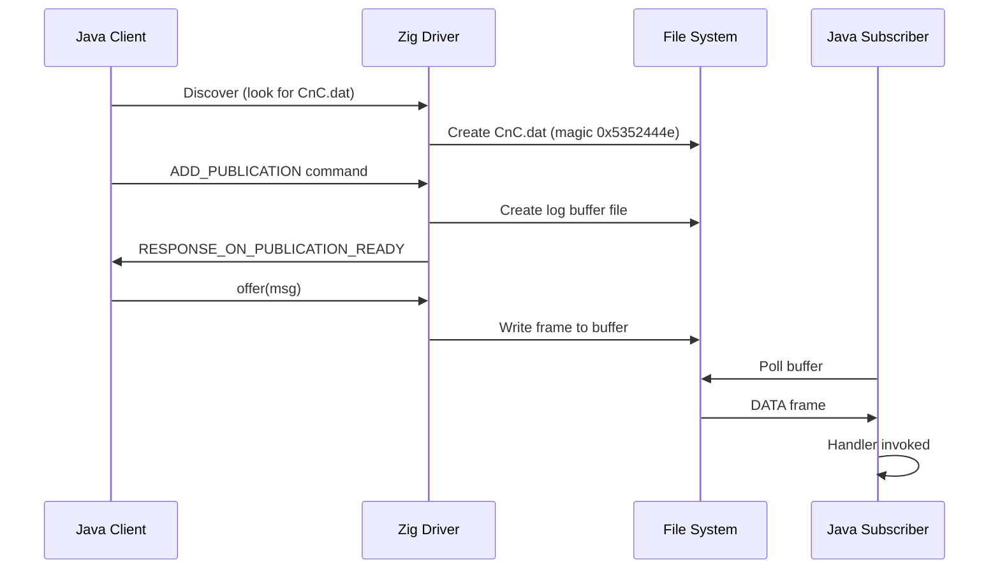

# 4.4 Java Interop and Wire Compatibility

One of Aeron's greatest strengths is its cross-language wire compatibility. A publisher written in Zig can send messages to a subscriber in Java, C++, C#, or Go without any changes to the protocol.

!!! abstract "What you'll build"
    Wire compatibility between Zig and Java Aeron clients:

    - The `extern struct` guarantee: C ABI layout matching
    - The handshake protocol: discovery, command, response
    - End-to-end round-trip: Zig publisher to Java subscriber and back
    - Interop test infrastructure: Docker-based cross-language verification
    - Known gaps: Archive SBE, Cluster consensus framing



## How It Works: The `extern struct` Bridge

!!! tip "Zig technique: extern struct for wire compatibility"
    In Zig, we achieve wire compatibility using `extern struct`. This guarantees that the memory layout matches the C ABI, which is what the reference Aeron implementation uses.

    ```zig
    // LESSON(frame-codec/zig): extern struct guarantees C-compatible memory layout.
    pub const DataHeader = extern struct {
        frame_length: i32,
        version: u8,
        flags: u8,
        type: u16,
        term_offset: i32,
        session_id: i32,
        stream_id: i32,
        term_id: i32,
        reserved_value: i64 align(4), // Aeron uses #pragma pack(4)
    };
    ```

    By using `align(4)` on `i64` fields, we precisely match the `#pragma pack(4)` used in the Java/C drivers, ensuring every byte is in the exact same position.

## The Handshake: Zig Driver ↔ Java Client

!!! info "Aeron concept: Discovery and handshake protocol"
    When a Java client connects to the `harus-aeron-zig` media driver:

    1. **Discovery**: The Java client looks for `CnC.dat` in the directory specified by `aeron.dir`. Our Zig driver creates this file with the exact magic number (`0x5352444e`) and version that Java expects.
    2. **Command**: The Java client writes an `ADD_PUBLICATION` command into the `to-driver` ring buffer (shared memory).
    3. **Action**: Our `DriverConductor` (Zig) reads the command, allocates a session ID, and creates a log buffer file on disk.
    4. **Response**: The Conductor writes a `RESPONSE_ON_PUBLICATION_READY` message to the `to-clients` broadcast buffer.
    5. **Ready**: The Java client sees the response, maps the new log buffer file, and is ready to call `publication.offer()`.

## Known Gaps and Future Work

!!! warning "Known incompleteness: Archive and Cluster protocols"
    While the core data path (Unicast/Multicast UDP, IPC, Flow Control) is fully wire-compatible, some higher-level protocols are still being aligned:

    **Archive Protocol (SBE):**
    Aeron Archive uses **SBE (Simple Binary Encoding)** for its control messages. `harus-aeron-zig` currently uses a simplified version of this protocol. To be fully compatible with the Java Archive, we need to implement the full SBE schema for recording and replay commands.

    **Cluster Consensus:**
    The Cluster protocol involves complex Raft-based state machine replication. While the `ConsensusModule` in this project follows the same logic as the Java version, the specific binary framing for session lifecycle events (e.g., `NewLeadershipTerm`) may require further audit to be 100% bit-for-bit compatible with the Java `aeron-cluster`.

## Verification: The Interop Smoke Test

!!! note "Interop test harness"
    You can run the cross-language tests using Docker:

    ```bash
    AERON_INTEROP=1 make test-interop
    ```

    This launches a Java `BasicPublisher` and a Zig `BasicSubscriber` (or vice versa) and verifies that all 100 messages are delivered correctly across the language boundary.

!!! question "Exercise: Verify wire compatibility"
    1. [ ] Run the interop test suite with `AERON_INTEROP=1 make test-interop`.
    2. [ ] Check `test/interop/docker-compose.yml` to see how the Java and Zig containers are wired together via a shared `/tmp/aeron` volume.
    3. [ ] Inspect one wire trace: capture traffic between containers and decode a DATA frame using the format tables from [Aeron Protocol Specification](https://github.com/aeron-io/aeron/wiki/Protocol-Specification).

!!! tip "Further reading"
    [Aeron Protocol Specification](https://github.com/aeron-io/aeron/wiki/Protocol-Specification)
