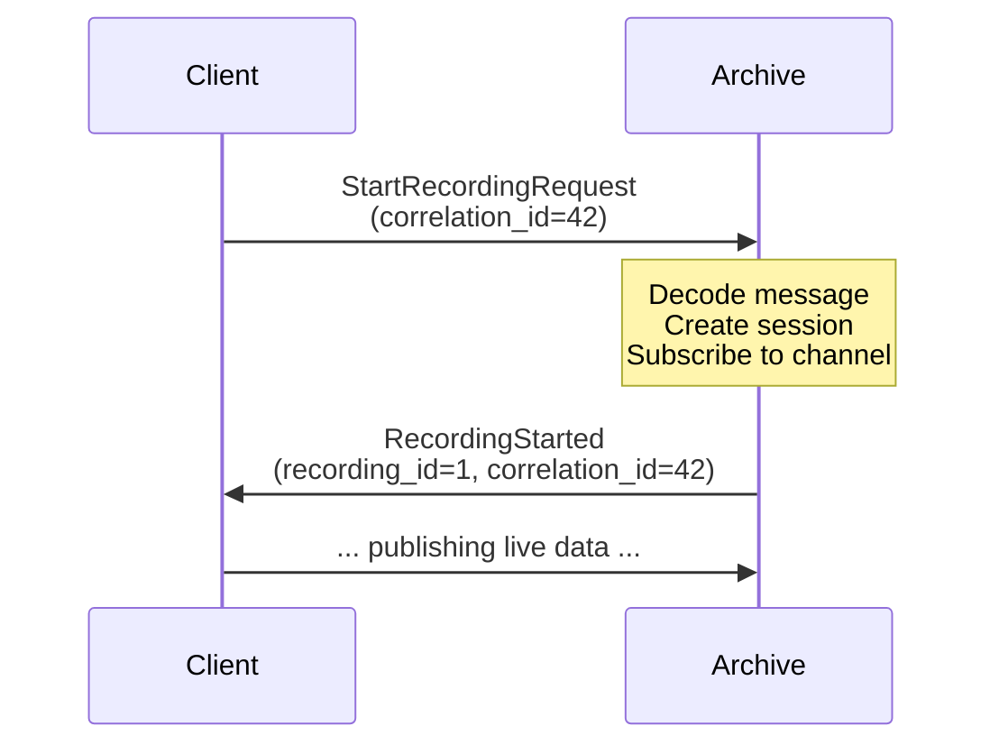

# 5.1 Archive Protocol

Aeron is a fire-and-forget messaging system by default — messages live in shared-memory log buffers and are lost once they're overwritten. For applications that need a persistent audit trail (financial markets, event sourcing, state recovery), the Aeron Archive records published streams to disk and replays them on demand.

> [!NOTE]
> **What you'll build**
> A precise mental model of how clients and the archive communicate via binary protocol messages:
>
> - Fixed-size binary request/response structs (StartRecordingRequest, ReplayRequest, ControlResponse)
> - A pair of helper functions to encode/decode variable-length channel strings
> - How correlation IDs enable asynchronous request/response matching
> - The complete message family that controls recording, replay, and metadata queries

> [!NOTE]
> **Aeron concept: Archive as a client service**
> The Aeron Archive is not part of the media driver — it's a separate service that acts as an
> Aeron **client**. To communicate with it, your application publishes control messages (like
> `StartRecordingRequest` or `ReplayRequest`) on a well-known archive control channel. The archive
> subscribes to that channel, decodes the messages, and publishes responses back on a client-specific
> response channel, matched by `correlation_id`.
>
> This design decouples the archive from the driver and lets you run multiple archives alongside
> the same media driver, each serving different applications with different retention policies.



The archive receives `StartRecordingRequest`, which includes:
- `correlation_id` — opaque number the client sends; archive echoes it back
- `stream_id` — which stream on the channel to record
- `channel_length` — length of the channel URI string, which follows in the buffer
- Variable-length channel string — e.g., `aeron:udp?endpoint=localhost:40123`

### Message Families

All archive control messages follow the same pattern: a fixed-size header (usually 16–72 bytes) followed by optional variable-length data (channel strings, error messages).

| Message Type | MSG_TYPE_ID | Direction | Purpose |
|---|---|---|---|
| `StartRecordingRequest` | 1 | Client → Archive | Begin recording a stream |
| `StopRecordingRequest` | 2 | Client → Archive | Stop an active recording |
| `ReplayRequest` | 3 | Client → Archive | Replay a range of bytes |
| `StopReplayRequest` | 4 | Client → Archive | Stop a replay session |
| `ListRecordingsRequest` | 5 | Client → Archive | List recorded streams |
| `ControlResponse` | 101 | Archive → Client | Success/error code |
| `RecordingStarted` | 102 | Archive → Client | New recording created |
| `RecordingDescriptor` | 104 | Archive → Client | Metadata for a recording |

> [!NOTE]
> **Zig concept: `extern struct` with length-prefixed variable data**
> Most Aeron protocols use `extern struct` to guarantee bit-exact C ABI layout. But how do you
> encode variable-length fields (like a channel string) in a fixed-size struct? The answer is a
> pattern borrowed from Simple Binary Encoding (SBE): a fixed header followed by a length prefix
> and the variable data itself.
>
> The struct is fixed-size (e.g., 16 bytes for `StartRecordingRequest`). The `channel_length` field
> tells you how many bytes follow it in the buffer. This is similar to SBE, used by real Aeron.
>
> **Why this pattern?**
> - No padding overhead: strings can be any length; you only pay for what you use.
> - Zero-copy reads: a slice into the buffer, not a separate allocation.
> - Wire-compatible: clients and the archive can be in different languages.
> - Atomicity: the struct + length + data form one logical message; no partial reads.
>
> **Zig-specific details:**
> - `@intCast(channel.len)` converts `usize` to `i32`; Zig does not auto-convert between int sizes.
> - `std.mem.writeInt(..., .little)` specifies little-endian byte order, matching Aeron Java/C++.
> - `@memcpy(dst, src)` is Zig's safe memory copy — the compiler verifies sizes match at comptime.

### The Pattern

```zig
pub const StartRecordingRequest = extern struct {
    correlation_id: i64,   // 8 bytes
    stream_id: i32,        // 4 bytes
    source_location: i32,  // 4 bytes
    channel_length: i32,   // 4 bytes (describes what follows)
    // Variable-length channel follows in the buffer
};

pub fn encodeChannel(buf: []u8, channel: []const u8) !usize {
    if (buf.len < 4 + channel.len) {
        return error.BufferTooSmall;
    }
    // Write length as little-endian i32
    std.mem.writeInt(i32, buf[0..4], @intCast(channel.len), .little);
    // Write string data immediately after
    @memcpy(buf[4 .. 4 + channel.len], channel);
    return 4 + channel.len;
}

pub fn decodeChannel(buf: []const u8) ?[]const u8 {
    if (buf.len < 4) return null;
    const len = std.mem.readInt(i32, buf[0..4], .little);
    if (len < 0 or buf.len < 4 + len) return null;
    return buf[4 .. 4 + @as(usize, @intCast(len))];
}
```

## The Code

Open `src/archive/protocol.zig`:

```zig
pub const StartRecordingRequest = extern struct {
    correlation_id: i64,
    stream_id: i32,
    source_location: i32,
    channel_length: i32,
    // Variable-length channel follows in the buffer

    pub const HEADER_LENGTH = @sizeOf(StartRecordingRequest);
    pub const MSG_TYPE_ID: i32 = 1;
};

pub const ReplayRequest = extern struct {
    correlation_id: i64,
    recording_id: i64,
    position: i64,
    length: i64,
    replay_stream_id: i32,
    replay_channel_length: i32,
    // Variable-length replay_channel follows in the buffer

    pub const HEADER_LENGTH = @sizeOf(ReplayRequest);
    pub const MSG_TYPE_ID: i32 = 3;
};

pub const RecordingDescriptor = extern struct {
    recording_id: i64,
    start_timestamp: i64,
    stop_timestamp: i64,
    start_position: i64,
    stop_position: i64,
    initial_term_id: i32,
    segment_file_length: i32,
    term_buffer_length: i32,
    mtu_length: i32,
    session_id: i32,
    stream_id: i32,
    channel_length: i32,
    // Variable-length channel follows in the buffer

    pub const HEADER_LENGTH = @sizeOf(RecordingDescriptor);
    pub const MSG_TYPE_ID: i32 = 104;
};
```

Every request has a `correlation_id` so the archive can echo it back in the response. Responses match the request by this ID, allowing clients to multiplex multiple async operations.

Notice that `RecordingDescriptor` includes all the metadata a replayer needs:
- `initial_term_id`, `term_buffer_length`, `mtu_length` — stream geometry
- `start_position`, `stop_position` — byte range in the recording
- `channel` (variable) — which channel was recorded

A client asking "what's in recording #5?" gets back this descriptor and can immediately reconstruct a replay stream using the same flow-control and fragmentation logic as a live subscriber.

### Helper Functions

```zig
pub fn encodeChannel(buf: []u8, channel: []const u8) !usize {
    if (buf.len < 4 + channel.len) {
        return error.BufferTooSmall;
    }
    const channel_len: i32 = @intCast(channel.len);
    std.mem.writeInt(i32, buf[0..4], channel_len, .little);
    @memcpy(buf[4 .. 4 + channel.len], channel);
    return 4 + channel.len;
}

pub fn decodeChannel(buf: []const u8) ?[]const u8 {
    if (buf.len < 4) return null;
    const channel_len = std.mem.readInt(i32, buf[0..4], .little);
    if (channel_len < 0 or buf.len < 4 + channel_len) return null;
    return buf[4 .. 4 + @as(usize, @intCast(channel_len))];
}
```

These two functions are the entire serialization story for the archive:
1. When sending a request with a channel, `encodeChannel` packs the length and data.
2. When receiving a response with a channel, `decodeChannel` unpacks it.

The archive conductor (which we'll see in chapter 5.5) uses these same helpers to encode responses before publishing them.

> [!NOTE]
> **Exercise**
> Implement `encodeChannel` and `decodeChannel` in `tutorial/archive/protocol.zig`.
>
> Your task:
> 1. Write a function that encodes a channel string into a buffer with a 4-byte length prefix (little-endian i32).
> 2. Write a function that decodes a channel string from a buffer, validating the length prefix.
>
> Acceptance criteria:
> - [ ] `encodeChannel` returns the total bytes written (length prefix + string)
> - [ ] `decodeChannel` returns a slice into the buffer if valid, null if buffer is too small or length is negative
> - [ ] Round-trip test: encode `"aeron:udp?endpoint=localhost:40123"`, decode it, and verify it matches
>
> Hint: Use `std.mem.writeInt`, `std.mem.readInt`, and `@intCast` as shown above.

```bash
cd /Users/azusachino/Projects/project-github/harus-aeron-zig
make test-unit  # Run protocol tests
```

Compare your implementation against `src/archive/protocol.zig`.

> [!IMPORTANT]
> **Key takeaways**
> - **Archive is a client**: it communicates with your application via standard Aeron Publications/Subscriptions, not shared-memory rings.
> - **Fixed headers + variable data**: struct size is comptime-constant; string length is runtime data. `channel_length` tells you how many bytes follow.
> - **Correlation IDs**: every request/response pair shares a correlation ID, allowing async multiplexing without a shared request queue.
> - **Zig's `@intCast` and `std.mem` primitives**: no hidden allocations, no serialization library overhead. You control every byte.
> - **Wire compatibility**: if you can encode/decode these binary structs correctly, you can talk to real Aeron Java clients.
