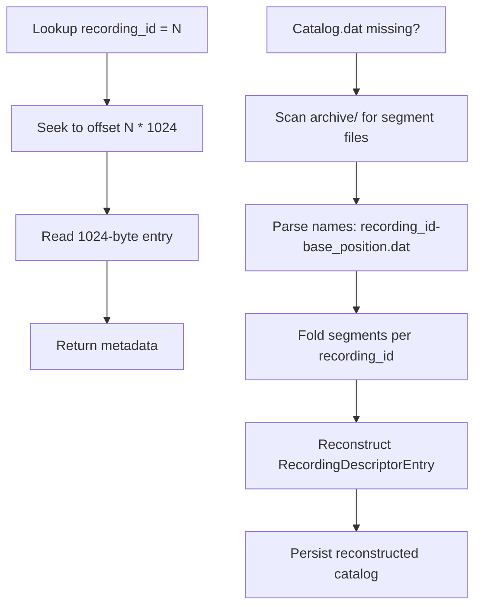

# 5.2 Catalog

Once the archive starts recording, it needs to remember what it recorded — where each stream's bytes live on disk, what channel and stream ID it used, when it started and stopped. The Catalog is a persistent flat-file index that answers these questions in O(1) time.

!!! abstract "What you'll build"
    A flat binary file where each recording gets a fixed-size entry (1024 bytes):

    - Recording IDs are sequential: recording #1 lives at byte offset 1024, recording #2 at offset 2048
    - Fast O(1) lookup by recording_id using simple arithmetic (no B-tree, no scanning)
    - Atomic updates to stop position and stop timestamp in a single persist call
    - Catalog recovery by scanning the archive directory for segment files when the catalog is corrupted or missing

!!! info "Aeron concept: Flat-file indexing for durability"
    Real Aeron archives (Java and C++) use a catalog file to persist recording metadata across restarts.
    The design trades a small amount of wasted space (unused fields in each 1024-byte entry) for
    predictable O(1) lookup and no index data structure.

    When a client asks "what's in recording #42?", the archive seeks to byte offset `42 * 1024` and reads
    exactly one entry. No B-tree, no scan. For an archive that might hold millions of recordings, this is
    a critical performance choice.



!!! info "Zig concept: Flat binary files and seek arithmetic"
    Instead of a B-tree or a hash table, Zig's flat-file approach uses simple arithmetic to map a key
    to a file offset. Fixed-size entries enable predictable seeking.

```zig
pub const RecordingDescriptorEntry = extern struct {
    recording_id: i64,
    start_timestamp: i64,
    stop_timestamp: i64,      // 0 = still recording
    start_position: i64,
    stop_position: i64,
    initial_term_id: i32,
    segment_file_length: i32,
    term_buffer_length: i32,
    mtu_length: i32,
    session_id: i32,
    stream_id: i32,
    channel_length: i32,
    channel: [256]u8,         // Fixed-size field for the channel string
    source_identity_length: i32,
    source_identity: [256]u8, // Fixed-size field for the source
    _reserved: [440]u8,       // Padding to exactly 1024 bytes

    comptime {
        std.debug.assert(@sizeOf(RecordingDescriptorEntry) == 1024);
    }
};
```

The comptime assertion catches any size mismatches at compile time. If you add a field and break the layout, the build fails immediately.

### Load and Persist

```zig
const io_mod = @import("../io.zig");

pub const Catalog = struct {
    entries: std.ArrayList(RecordingDescriptorEntry),
    next_recording_id: i64,

    /// Load catalog from disk: read all 1024-byte entries
    fn loadFromDisk(self: *Catalog, path: []const u8) !void {
        const file = try std.Io.Dir.cwd().openFile(io_mod.io(), path, .{});
        defer file.close(io_mod.io());

        var buf: [1024]u8 = undefined;
        while ((try file.read(io_mod.io(), &buf)) > 0) {
            var entry: RecordingDescriptorEntry = undefined;
            @memcpy(std.mem.asBytes(&entry), &buf);
            try self.entries.append(self.allocator, entry);
        }
    }

    /// Persist catalog: write all entries as sequential 1024-byte chunks
    fn persist(self: *Catalog, path: []const u8) !void {
        const file = try std.Io.Dir.cwd().createFile(io_mod.io(), path, .{ .truncate = true });
        defer file.close(io_mod.io());
        try file.writeStreamingAll(io_mod.io(), std.mem.sliceAsBytes(self.entries.items));
    }
};
```

!!! note "Zig 0.16 file I/O"
    In Zig 0.16, file operations thread an `std.Io` through all operations. The project hands it out via
    `io_mod.io()`, making it convenient to pass to file methods like `openFile()`, `createFile()`, `close()`,
    `read()`, and `writeStreamingAll()`.

## The Code

Open `src/archive/catalog.zig`:

```zig
pub const Catalog = struct {
    allocator: std.mem.Allocator,
    entries: std.ArrayList(RecordingDescriptorEntry),
    next_recording_id: i64,
    path: ?[]u8,

    /// Add a new recording and return its recording_id
    pub fn addNewRecording(
        self: *Catalog,
        session_id: i32,
        stream_id: i32,
        channel: []const u8,
        source_identity: []const u8,
        initial_term_id: i32,
        segment_file_length: i32,
        term_buffer_length: i32,
        mtu_length: i32,
        start_position: i64,
        start_timestamp: i64,
    ) !i64 {
        var entry: RecordingDescriptorEntry = undefined;
        @memset(std.mem.asBytes(&entry), 0);

        entry.recording_id = self.next_recording_id;
        entry.session_id = session_id;
        entry.stream_id = stream_id;
        entry.channel_length = @intCast(channel.len);
        @memcpy(entry.channel[0..channel.len], channel);
        // ... set more fields ...

        try self.entries.append(self.allocator, entry);
        const recording_id = self.next_recording_id;
        self.next_recording_id += 1;
        try self.persist();
        return recording_id;
    }

    /// Lookup recording descriptor by ID — O(1) in ideal case
    pub fn recordingDescriptor(self: *const Catalog, recording_id: i64) ?*const RecordingDescriptorEntry {
        for (self.entries.items) |*entry| {
            if (entry.recording_id == recording_id) {
                return entry;
            }
        }
        return null;
    }

    /// Atomically update stop position and timestamp
    pub fn updateStopState(
        self: *Catalog,
        recording_id: i64,
        stop_position: i64,
        stop_timestamp: i64,
    ) !void {
        for (self.entries.items) |*entry| {
            if (entry.recording_id == recording_id) {
                entry.stop_position = stop_position;
                entry.stop_timestamp = stop_timestamp;
                try self.persist();
                return;
            }
        }
    }
};
```

The `@memset(std.mem.asBytes(&entry), 0)` call zero-initializes the entire entry, including all padding. This ensures no garbage bytes leak into the persistent catalog.

### Catalog Recovery

When the catalog.dat file is missing or corrupted, the `reconstructFromSegments()` function scans the archive directory for files like `1-0.dat`, `1-128000000.dat`, `2-0.dat` and rebuilds the catalog. This is essential for disaster recovery.

The file naming scheme encodes the recording ID and base position: `<recording_id>-<base_position>.dat`. A parser extracts both and reconstructs entries without relying on the catalog file.

!!! question "Exercise"
    Implement `recordingDescriptor` and `updateStopState` in `tutorial/archive/catalog.zig`.

    Your task:
    1. Implement `recordingDescriptor(recording_id)` — iterate through entries and return the one matching the ID, or null if not found.
    2. Implement `updateStopState(recording_id, stop_position, stop_timestamp)` — find the entry, atomically update both fields, then persist.

    Acceptance criteria:
    - [ ] `recordingDescriptor` returns the entry or null
    - [ ] `updateStopState` finds the matching entry and updates both fields in one persist call
    - [ ] After calling `updateStopState`, a fresh Catalog loaded from the same path sees the updated values

    Hint: The `persist()` function already writes all entries to disk; just find the entry, update it, and call persist.

```bash
cd /Users/azusachino/Projects/project-github/harus-aeron-zig
make test-unit
```

Then compare your code against `src/archive/catalog.zig`.

!!! success "Key takeaways"
    - **Flat files beat hash tables for durability**: no index structure to rebuild, no garbage collection.
    - **Fixed-size entries enable O(1) lookup**: byte offset = recording_id * entry_size.
    - **Comptime assertions catch layout bugs**: `@sizeOf` is checked at compile time, not runtime.
    - **Catalog recovery**: if the index is lost, scan the directory for segment files and rebuild.
    - **Atomicity**: update both stop_position and stop_timestamp in one persist call, never leaving a partial state on disk.
