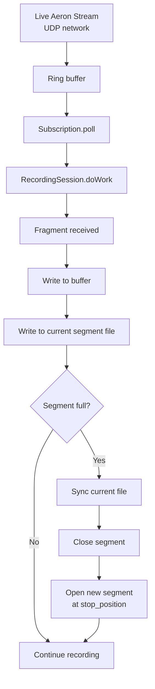

# 5.3 Recorder

The Catalog tells you what was recorded. The Recorder is the component that *does* the recording — it subscribes to live Aeron streams, pulls fragments as they arrive, and writes them to disk in segmented files.

> [!NOTE]
> **What you'll build**
> A multi-component recording system:
>
> - **RecordingWriter**: buffers incoming media frames and rotates to new segment files when a threshold is crossed
> - **RecordingSession**: owns a Subscription and uses the RecordingWriter to persist fragments
> - **Recorder**: duty agent that polls all active sessions and advances their state machines

> [!NOTE]
> **Aeron concept: Subscription-based recording with segment rotation**
> When you call `StartRecordingRequest`, the archive creates a `RecordingSession` that subscribes
> to your channel/stream using the same Subscription API you use in your application code. Incoming
> fragments flow through the subscription's ring buffer; the session's duty cycle polls them and
> writes them to disk.
>
> Segment rotation — splitting a large recording into fixed-size files — makes file handling predictable.
> If you have a 1GB recording in a single file, seeking and reading are slower than splitting it into
> 128MB chunks. The archive uses power-of-2 segment sizes so the math is simple: seek to
> `base_position + (offset % segment_length)` to find a byte within a segment.



> [!NOTE]
> **Zig concept: File I/O and segment rotation**
> Recording is a simple state machine: receive a fragment, append to buffer, check if we should
> rotate, flush to disk. In Zig 0.16, file operations require passing an `std.Io` context through
> each method call, obtained via `io_mod.io()`.

### RecordingWriter Structure

```zig
const io_mod = @import("../io.zig");

pub const RecordingWriter = struct {
    file: ?std.Io.File,                 // Current segment file
    start_position: i64,                // Position where this recording started
    stop_position: i64,                 // Current write position
    current_segment_base: i64,          // Position of the first byte in this segment
    segment_file_length: i64,           // Max bytes per segment; 0 = no rotation
    buffer: std.ArrayList(u8),          // In-memory buffer for current segment

    /// Write raw frame data and check if we need to rotate
    pub fn write(self: *RecordingWriter, data: []const u8) !void {
        try self.buffer.appendSlice(self.allocator, data);
        if (self.file) |*file| {
            try file.writeStreamingAll(io_mod.io(), data);
        }
        self.stop_position += @as(i64, @intCast(data.len));

        // Rotate if current segment is full
        if (self.segment_file_length > 0 and
            self.stop_position - self.current_segment_base >= self.segment_file_length)
        {
            try self.rotateSegment();
        }
    }

    /// Close current file, start a new one at stop_position
    fn rotateSegment(self: *RecordingWriter) !void {
        if (self.file) |f| {
            try f.sync(io_mod.io());
            f.close(io_mod.io());
        }
        self.buffer.clearRetainingCapacity();
        self.current_segment_base = self.stop_position;

        // Name new file: <recording_id>-<base_position>.dat
        self.path = try segmentFilePath(
            self.allocator,
            self.archive_dir,
            self.recording_id,
            self.current_segment_base
        );
        self.file = try std.Io.Dir.cwd().createFile(io_mod.io(), self.path, .{ .truncate = true });
    }
};

> [!NOTE]
> **Zig 0.16 file I/O**
> File I/O methods like `writeStreamingAll()`, `sync()`, `close()`, and `createFile()` now take
> an `std.Io` as their first argument. This is threaded through via `io_mod.io()`.

### RecordingSession

```zig
pub const RecordingSession = struct {
    subscription: *Subscription,        // Live data source
    writer: RecordingWriter,            // Disk sink
    catalog_entry_id: i64,              // ID returned by catalog.addNewRecording()

    /// Poll subscription and write any fragments to disk
    pub fn doWork(self: *RecordingSession) !i32 {
        var total_work: i32 = 0;

        // Poll up to 10 fragments
        const work = try self.subscription.poll(handler, 10);
        total_work += work;

        return total_work;
    }

    /// Fragment handler called by subscription.poll()
    fn handler(self: *RecordingSession, fragment: Fragment) void {
        self.writer.write(fragment.buffer) catch |err| {
            std.debug.print("write error: {}\n", .{err});
        };
    }
};
```

### Recorder Agent

```zig
pub const Recorder = struct {
    allocator: std.mem.Allocator,
    sessions: std.ArrayList(RecordingSession),

    /// Advance all active recording sessions by one poll cycle
    pub fn doWork(self: *Recorder) !i32 {
        var total_work: i32 = 0;
        for (self.sessions.items) |*session| {
            total_work += try session.doWork();
        }
        return total_work;
    }

    /// Start a new recording session
    pub fn startRecording(self: *Recorder, cmd: StartRecordingCmd) !RecordingSession {
        // Subscribe to the channel
        const subscription = try aeron.subscribe(cmd.channel, cmd.stream_id);

        // Create RecordingWriter
        const writer = try RecordingWriter.initWithSegment(
            self.allocator,
            recording_id,
            0,  // start_position
            cmd.segment_file_length,
            "/tmp/aeron-archive"
        );

        return RecordingSession{
            .subscription = subscription,
            .writer = writer,
            .catalog_entry_id = recording_id,
        };
    }

    /// Stop a recording session and return its final position
    pub fn stopRecording(self: *Recorder, recording_id: i64) !i64 {
        for (self.sessions.items, 0..) |session, i| {
            if (session.catalog_entry_id == recording_id) {
                const stop_position = session.writer.stop_position;
                session.subscription.close();
                session.writer.deinit();
                _ = self.sessions.swapRemove(i);
                return stop_position;
            }
        }
        return error.RecordingNotFound;
    }
};
```

The rotation check `stop_position - current_segment_base >= segment_file_length` ensures we only rotate after a segment is full. By using `segment_file_length = 128 * 1024 * 1024` (power of 2), seeking within a segment is fast: to find byte X in recording Y, compute `base = (X / 128M) * 128M` and seek to that offset in file `Y-{base}.dat`.

## The Code

Open `src/archive/recorder.zig` and scan these functions:

- `RecordingWriter.write()` — append to buffer, check rotation
- `RecordingWriter.rotateSegment()` — close current file, open next
- `RecordingSession.doWork()` — poll subscription, feed fragments to writer
- `Recorder.startRecording()` — create a new session
- `Recorder.doWork()` — duty cycle that advances all sessions

The key insight is that the Recorder is a *consumer* of your application's published data. It uses the same Subscription API as any Aeron client, so fragmentation, flow control, and NAK-based retransmission all work transparently. The archive never has to "chase" slow publishers or handle backpressure specially — Aeron's receiver handles it.

> [!NOTE]
> **Exercise**
> Implement the `RecordingWriter.write()` rotation logic in `tutorial/archive/recorder.zig`.
>
> Your task:
> 1. Append the data to the in-memory buffer and the file.
> 2. Increment `stop_position`.
> 3. Check if rotation is needed: `segment_file_length > 0` && `stop_position - current_segment_base >= segment_file_length`.
> 4. If so, call `rotateSegment()`.
>
> Acceptance criteria:
> - [ ] Writing a fragment appends it to both buffer and file
> - [ ] When the segment is full, `rotateSegment()` is called automatically
> - [ ] After rotation, the next write goes to a new file with an updated `current_segment_base`
> - [ ] Segment filenames follow the pattern `<recording_id>-<base_position>.dat`
>
> Hint: Segment rotation happens in-place; don't allocate a new RecordingWriter. Just close the old file, update `current_segment_base`, and open a new file.

```bash
cd /Users/azusachino/Projects/project-github/harus-aeron-zig
make test-unit
```

Run a simple test: create a RecordingWriter with `segment_file_length = 100`, write 150 bytes, and verify two files are created.

> [!IMPORTANT]
> **Key takeaways**
> - **Subscription-based recording**: use the same polling loop as a live subscriber; no special-case code path.
> - **Segment rotation**: fixed-size segments enable predictable seeking and make files manageable.
> - **Power-of-2 sizing**: segment boundaries line up with binary arithmetic (`& (size - 1)` is faster than `% size`).
> - **Duty cycle pattern**: Recorder polls all sessions once per cycle; work count signals whether more polling might help.
> - **No copies between formats**: fragments go from network → logbuffer → segment file; the same bytes, moved once.
