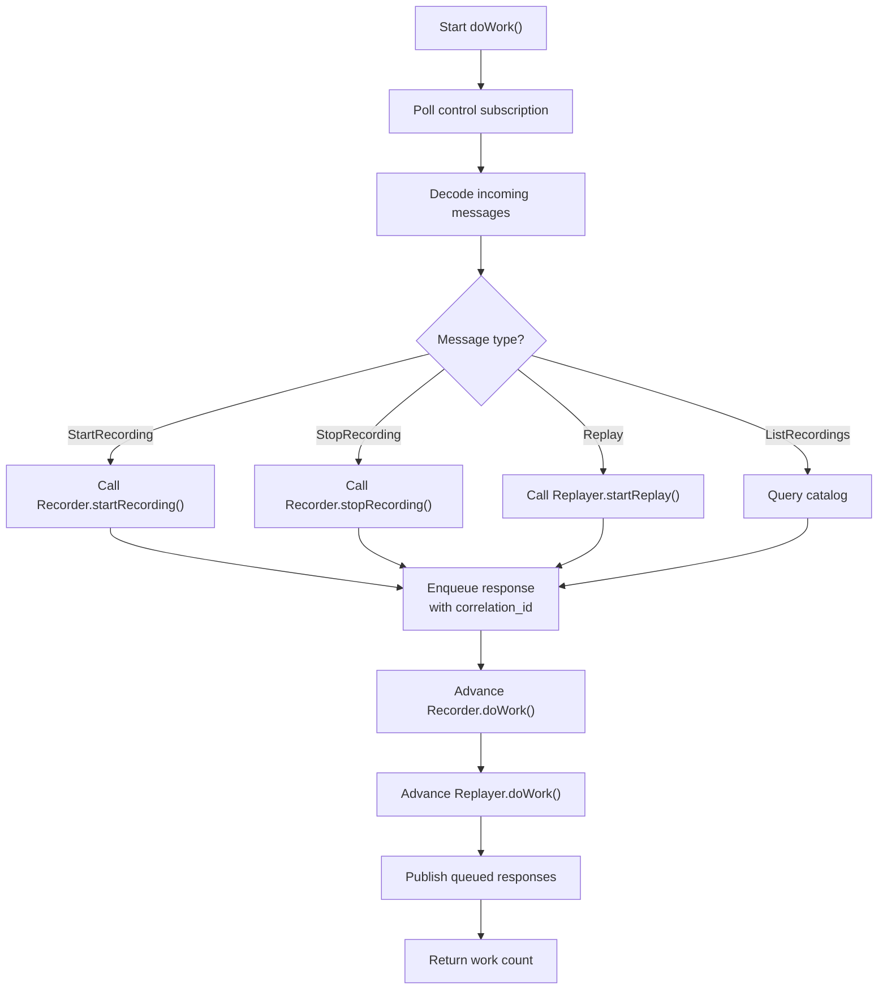

# 5.5 Archive Conductor

You've seen the pieces: Catalog stores metadata, Recorder captures streams, Replayer reads them back. The ArchiveConductor is the dispatcher that glues them together — it listens for control commands from clients, routes them to the appropriate component, and sends responses back.

!!! abstract "What you'll build"
    A complete command/response dispatcher:

    - Polls an Aeron Subscription for control messages (StartRecordingRequest, ReplayRequest, etc.)
    - Decodes messages and routes them to Recorder or Replayer
    - Enqueues responses back to the client, matched by correlation ID
    - Advances all components through a unified duty cycle

!!! info "Aeron concept: Command dispatch and correlation-ID matching"
    The archive is a separate service from the media driver. It needs a way to receive commands from
    many clients and respond to each one. The solution is the same pattern the media driver uses for
    its conductor:

    1. **Command subscription**: the archive subscribes to a well-known control channel.
    2. **Message decoding**: incoming messages are decoded by type ID and parameters extracted.
    3. **Dispatch**: each command type triggers a handler (start recording, stop recording, replay, etc.).
    4. **Response enqueuing**: handlers enqueue responses (with the original correlation ID) for delivery
       back to the client.
    5. **Duty cycle**: `doWork()` is called repeatedly, advancing the state machines.

    Because the archive uses standard Aeron Publications for responses (not shared-memory rings), clients
    can be on different machines, different programs, even different languages. The protocol is just
    binary messages.

    The key is **correlation ID**: every request includes a unique ID, and the archive echoes it back in
    responses. This allows clients to multiplex multiple async commands without blocking.



!!! info "Zig concept: Command union and exhaustive switching"
    Archive commands come in many types (StartRecording, StopRecording, Replay, etc.). How do you
    handle them uniformly while staying type-safe? Answer: a tagged union. The Zig compiler verifies
    that your `switch` statement covers all variants, preventing missed cases.

### Command Union

```zig
pub const StartRecordingCmd = struct {
    correlation_id: i64,
    session_id: i32,
    stream_id: i32,
    channel: []const u8,
    source_identity: []const u8,
};

pub const ReplayCmd = struct {
    correlation_id: i64,
    recording_id: i64,
    position: i64,
    length: i64,
};

pub const Command = union(enum) {
    start_recording: StartRecordingCmd,
    stop_recording: StopRecordingCmd,
    replay: ReplayCmd,
    stop_replay: StopReplayCmd,
    list_recordings: ListRecordingsCmd,
};
```

### Decoding and Dispatch

```zig
pub const ArchiveConductor = struct {
    pending_commands: std.ArrayList(Command),
    responses: std.ArrayList(Response),

    pub fn doWork(self: *ArchiveConductor) !i32 {
        var total_work: i32 = 0;

        // Poll control subscription for new commands
        // (Subscription.poll is chapter 4)
        total_work += try self.pollControlStream();

        // Process all pending commands
        for (self.pending_commands.items) |cmd| {
            switch (cmd) {
                .start_recording => |start_cmd| {
                    self.handleStartRecording(start_cmd) catch |err| {
                        // Enqueue error response
                        try self.enqueueResponse(start_cmd.correlation_id, error_code, error_msg);
                    };
                },
                .stop_recording => |stop_cmd| {
                    self.handleStopRecording(stop_cmd) catch |err| {
                        try self.enqueueResponse(stop_cmd.correlation_id, error_code, error_msg);
                    };
                },
                .replay => |replay_cmd| {
                    self.handleReplay(replay_cmd) catch |err| {
                        try self.enqueueResponse(replay_cmd.correlation_id, error_code, error_msg);
                    };
                },
                // ... more handlers ...
            }
        }
        self.pending_commands.clearRetainingCapacity();

        // Advance Recorder and Replayer
        total_work += try self.recorder.doWork();
        total_work += try self.replayer.doWork();

        // Publish queued responses
        total_work += try self.publishResponses();

        return total_work;
    }

    fn handleStartRecording(self: *ArchiveConductor, cmd: StartRecordingCmd) !void {
        // Create catalog entry
        const recording_id = try self.catalog.addNewRecording(
            cmd.session_id,
            cmd.stream_id,
            cmd.channel,
            cmd.source_identity,
            0,  // initial_term_id
            128 * 1024 * 1024,  // segment_file_length
            64 * 1024,  // term_buffer_length
            1408,  // mtu_length
            0,  // start_position
            now(),  // start_timestamp
        );

        // Create recording session in Recorder
        try self.recorder.startRecording(cmd);

        // Enqueue success response
        try self.enqueueResponse(cmd.correlation_id, ControlResponseCode.ok, recording_id);
    }

    fn enqueueResponse(
        self: *ArchiveConductor,
        correlation_id: i64,
        code: ControlResponseCode,
        recording_id: i64,
    ) !void {
        try self.responses.append(.{
            .correlation_id = correlation_id,
            .code = @intFromEnum(code),
            .recording_id = recording_id,
            .error_message = "",
        });
    }
};
```

The `switch` statement is exhaustive: if you add a new command variant to the union, the compiler forces you to add a handler for it. No missed cases.

## The Code

Open `src/archive/conductor.zig` and examine:

- **`doWork()`** — main duty cycle: poll control → dispatch → advance recorder/replayer → publish responses
- **`pollControlStream()`** — subscribe to control channel, decode incoming StartRecordingRequest, ReplayRequest, etc.
- **`handleStartRecording()`** — create catalog entry, start recorder session, enqueue success response
- **`handleReplay()`** — find recording in catalog, create replayer session, enqueue success response
- **`publishResponses()`** — publish all queued responses on the appropriate channels

The conductor owns the Catalog, Recorder, and Replayer. It is responsible for:
1. Receiving commands and parsing them (extract correlation_id, channel, etc.).
2. Creating entries in the catalog.
3. Starting/stopping recording and replay sessions.
4. Enqueueing responses matched by correlation_id.

!!! question "Exercise"
    Implement the `onStartRecording` helper in `tutorial/archive/conductor.zig`.

    Your task:
    1. Implement the `onStartRecording(self: *ArchiveConductor, channel: []const u8, stream_id: i32) void` helper.
    2. This method acts as the stub entry point for initiating a recording on the specified channel and stream ID.

    Acceptance criteria:
    - [ ] `onStartRecording` accepts a channel and stream_id.
    - [ ] Calling it panics with the `TODO: implement` message until solved.
    - [ ] `make tutorial-check` compile-checks successfully.

    Hint: In this exercise, the function signature is simplified to focus on how the conductor transitions to initiating a recording.

```bash
cd /Users/azusachino/Projects/project-github/harus-aeron-zig
make test-unit
```

Test scenario: send a StartRecordingRequest, verify the catalog entry and recorder session are created,
then verify the RecordingStarted response echoes the correct recording_id and correlation_id.

!!! success "Key takeaways"
    - **Conductor as dispatcher**: it's the single point where all commands are routed.
    - **Correlation IDs for async matching**: clients send a request with a unique ID; archive echoes it
      in responses.
    - **Tagged unions for type-safe dispatch**: `switch` on the command variant; compiler ensures all
      cases are handled.
    - **Duty cycle orchestration**: conductor calls `doWork()` on Recorder and Replayer each cycle,
      advancing their state machines.
    - **Command/response queues**: commands are parsed into a queue, dispatched, then responses are
      enqueued for publication.
