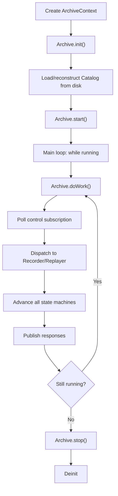

# 5.6 Archive Main

You now have Protocol (how to speak to the archive), Catalog (what was recorded), Recorder (capture streams), Replayer (replay them), and Conductor (route commands). The final piece is the top-level Archive — the context that owns and orchestrates all the components.

!!! abstract "What you'll build"
    The top-level archive service:

    - **ArchiveContext**: configuration struct (channels, paths, segment sizes)
    - **Archive**: owns the ArchiveConductor and exposes lifecycle methods (start/stop/doWork)
    - Understand how the pieces fit together
    - Wire up a standalone archive service or embed it in your application

!!! info "Aeron concept: Archive as a long-lived service"
    The archive is a long-lived service. It starts, waits for commands, processes them, and stops only
    when explicitly shut down or the process dies. The `Archive` struct encapsulates:

    - **Configuration** (ArchiveContext): where to store recordings, which channels to listen on.
    - **Lifecycle**: start/stop to control when it's active.
    - **Duty cycle**: `doWork()` to be called repeatedly by the host application or a dedicated thread.

    This design allows the archive to be embedded in your application or run as a separate service,
    depending on your deployment needs.



!!! info "Zig concept: Configuration structs with defaults"
    Zig has no default parameter values in function signatures, so the convention is to pass a
    configuration struct with optional fields. All fields have defaults, so callers can omit fields they
    don't need to customize.

### ArchiveContext

```zig
pub const ArchiveContext = struct {
    /// Channel for archive control requests/responses (client ↔ archive).
    control_channel: []const u8 = "aeron:udp?endpoint=localhost:8010",
    /// Stream ID for the control channel.
    control_stream_id: i32 = 10,
    /// Channel for recording event notifications.
    recording_events_channel: []const u8 = "aeron:udp?endpoint=localhost:8011",
    /// Stream ID for recording events.
    recording_events_stream_id: i32 = 11,
    /// Filesystem path where recordings and catalog are stored.
    archive_dir: []const u8 = "/tmp/aeron-archive",
    /// Maximum size of each recording segment file (default 128MB).
    segment_file_length: i64 = 128 * 1024 * 1024,
};
```

All fields have defaults, so you can create a context with just:
```zig
const ctx = ArchiveContext{};  // Use all defaults
```

Or customize specific fields:
```zig
var ctx = ArchiveContext{
    .archive_dir = "/var/aeron/recordings",
    .segment_file_length = 256 * 1024 * 1024,
};
```

### Archive Struct

```zig
pub const Archive = struct {
    allocator: std.mem.Allocator,
    ctx: ArchiveContext,
    conductor: conductor_mod.ArchiveConductor,
    is_running: bool = false,

    /// Initialize a new Archive.
    /// The conductor is created but not started; call start() to begin processing.
    pub fn init(allocator: std.mem.Allocator, ctx: ArchiveContext) !Archive {
        var conductor = try conductor_mod.ArchiveConductor.initWithArchiveDir(allocator, ctx.archive_dir);
        conductor.default_segment_file_length = @intCast(ctx.segment_file_length);
        return Archive{
            .allocator = allocator,
            .ctx = ctx,
            .conductor = conductor,
            .is_running = false,
        };
    }

    /// Free all Archive resources.
    pub fn deinit(self: *Archive) void {
        self.conductor.deinit();
    }

    /// Start the archive, allowing it to process commands.
    pub fn start(self: *Archive) void {
        self.is_running = true;
    }

    /// Stop the archive.
    pub fn stop(self: *Archive) void {
        self.is_running = false;
    }

    /// Run one duty cycle of the archive.
    /// If not running, returns 0.
    pub fn doWork(self: *Archive) !i32 {
        if (!self.is_running) {
            return 0;
        }
        return try self.conductor.doWork();
    }
};
```

## The Code

Open `src/archive/archive.zig`:

The file is intentionally simple. The `Archive` struct is just a container that:
1. Holds the configuration (ArchiveContext).
2. Owns the ArchiveConductor.
3. Exposes lifecycle methods (`start()`, `stop()`).
4. Delegates `doWork()` to the conductor.

There's no special logic in Archive itself — all the real work happens in the conductor, recorder, replayer, and catalog. Archive is the facade.

### Using the Archive

Here's how you'd use it in an application:

```zig
// Create a context with custom paths
var ctx = ArchiveContext{
    .archive_dir = "/var/aeron-recordings",
    .segment_file_length = 256 * 1024 * 1024,
};

// Initialize the archive
var archive = try Archive.init(allocator, ctx);
defer archive.deinit();

// Start it
archive.start();

// Run the duty cycle in a loop (or in a dedicated thread)
while (archive.isRunning()) {
    _ = try archive.doWork();
    // Sleep a bit to avoid busy-spinning
    std.time.sleep(std.time.ns_per_ms);
}

// Stop and clean up
archive.stop();
```

### Embedded vs. Standalone

**Embedded**: your application creates an Archive, calls `start()`, and polls `doWork()` in your main loop. The archive shares the same thread and allocator as your app.

**Standalone**: the archive runs in a separate thread or process, listening on well-known channels. Clients publish control requests to those channels; the archive responds on reply channels.

Both models use the same Archive struct and protocol. The only difference is deployment.

## The Startup Sequence

Let's walk through what happens when you start the archive:

1. **Create context**: define channels, paths, segment size.
2. **Init Archive**: allocate conductor, load catalog from disk (or reconstruct from segment files if catalog is missing).
3. **Call start()**: set `is_running = true`.
4. **Enter duty cycle**: repeatedly call `doWork()`.
5. **In doWork()**:
   - ArchiveConductor polls its control subscription for new commands.
   - For each command, dispatch to Recorder or Replayer.
   - Advance Recorder and Replayer state machines (they poll their active sessions).
   - Publish any queued responses back to clients.
6. **Receive StartRecordingRequest**:
   - Conductor creates a catalog entry.
   - Conductor starts a RecordingSession in the Recorder.
   - Session subscribes to the specified channel/stream.
   - In the next doWork() call, RecordingSession polls and writes to disk.
7. **Receive ReplayRequest**:
   - Conductor finds the recording in the catalog.
   - Conductor creates a ReplaySession in the Replayer.
   - Session opens the recording file and starts publishing.
8. **Stop**: call `archive.stop()`, wait for duty cycle to finish, call `deinit()`.

The entire system is driven by `doWork()` calls in a loop. No threads (unless you add them), no callbacks (except subscription.poll handlers). Just a simple duty cycle.

!!! question "Exercise"
    Implement `ArchiveProxy.startRecording` in `tutorial/archive/archive.zig`.

    Your task:
    1. Implement the `startRecording(self: *ArchiveProxy, correlation_id: i64, stream_id: i32, channel: []const u8, source_identity: []const u8) !void` method.
    2. Encode a start recording command and enqueue it toward the archive conductor.

    Acceptance criteria:
    - [ ] `startRecording` method is implemented.
    - [ ] Stub panics with `TODO` until implemented.
    - [ ] `make tutorial-check` compile-checks successfully.

```bash
cd /Users/azusachino/Projects/project-github/harus-aeron-zig
make test-unit
```

Look for tests in `src/archive/archive.zig` that demonstrate:
- Creating an Archive with custom context.
- Starting, doing work, and stopping.
- End-to-end: start recording, write some data, start replay, verify data is replayed.

!!! success "Key takeaways"
    - **Archive is a container**: it holds configuration and the conductor; all real work is delegated.
    - **ArchiveContext for configuration**: defaults for channels, paths, and segment sizing.
    - **Duty cycle**: `doWork()` is called repeatedly, advancing all state machines.
    - **Embedded or standalone**: same Archive struct, different deployment.
    - **Lifecycle management**: `init()`, `start()`, `doWork()`, `stop()`, `deinit()` — familiar patterns
      from the media driver.

---

## Concluding Part 5: Archive

You've built a complete persistent storage system for Aeron:
- **Chapter 5.1 (Protocol)**: binary encoding of control messages.
- **Chapter 5.2 (Catalog)**: flat-file index for O(1) lookup of recordings.
- **Chapter 5.3 (Recorder)**: subscribe to live streams, write to disk with segment rotation.
- **Chapter 5.4 (Replayer)**: read from disk, republish as live streams, handle back-pressure.
- **Chapter 5.5 (Conductor)**: dispatch control commands, manage lifecycle, enqueue responses.
- **Chapter 5.6 (Archive)**: wire it all together, expose a simple start/stop/doWork interface.

The archive is not part of the media driver — it's a separate, long-lived service. Clients communicate with it via standard Aeron Publications and Subscriptions, using a binary protocol matched by correlation ID.

This design is both powerful and simple: recordings are just bytes on disk, indexed by a flat catalog. Replay reuses the entire Aeron publication pipeline, so fragmentation and flow control work transparently. The conductor uses the same duty-cycle pattern as the media driver, so the architecture is familiar.

In Part 6, you'll build the Cluster — distributed consensus on top of the archive. The Cluster uses the same Archive for durability, the same Conductor pattern for command dispatch, and the same Publication/Subscription model for inter-node communication.
