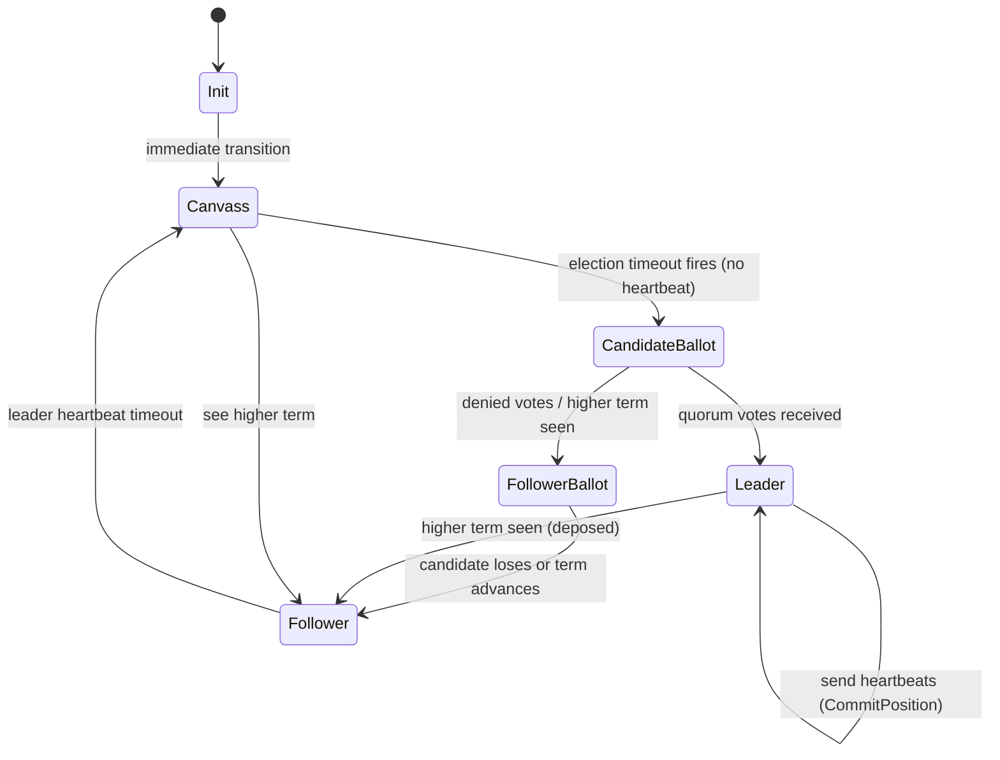

# 6.2 Election

In a distributed system, multiple nodes need to agree on **who is the leader**. If the leader crashes, the remaining nodes must elect a new one without human intervention. The Raft algorithm solves this with a simple but elegant state machine: followers wait for heartbeats; if they don't arrive, they become candidates and ask the cluster for votes.

This chapter explains how Raft leader election works — and why election timeouts are **randomized** to prevent infinite tie votes.

## What You'll Build

By the end of this chapter, you'll understand:
- The three Raft states: Follower, Candidate, Leader
- Why election timeouts are randomized (split-vote prevention)
- The vote-granting rules: only vote if candidate's log is at least as up-to-date
- What happens when a leader sees a higher term (immediately reverts to Follower)
- How the cluster tracks voting state across members

## Why It Works This Way (Aeron Concept)

Real Aeron Cluster's election (Java source: `aeron-cluster/src/main/java/io/aeron/cluster/Election.java`) implements the core Raft algorithm with a twist: instead of `RequestAppend` heartbeats, the leader broadcasts `CommitPosition` messages on the **consensus channel**. Followers watch the consensus channel for these heartbeats; if one doesn't arrive within the timeout window, the follower's election timer fires.

### The State Machine

Every cluster member runs an independent state machine that looks like this:



**Init**: Starting state. Immediately transitions to `Canvass`.

**Canvass**: "Waiting for an existing leader or preparing to run an election."
- Watches the consensus channel for heartbeats or higher-term announcements
- If election timeout fires without a heartbeat: transition to `CandidateBallot`
- If I see a higher term: update my term and go to `FollowerBallot` (wait for that higher-term leader)

**CandidateBallot**: "I think I should be leader; vote for me."
- Increment my `candidate_term_id`
- Send `RequestVote` to all other members
- Vote for myself
- Wait for a quorum of votes
- If I get a quorum: transition to `Leader`
- If I see a higher term or timeout: go back to `Canvass` (lost election)

**FollowerBallot**: "Another candidate is running the election; I voted for them."
- Wait for that candidate to win or for the election to fail
- If the candidate wins: they send `NewLeadershipTerm`, go to `Follower`
- If timeout: go back to `Canvass`

**Leader**: "I have a quorum; I'm the leader."
- Send `CommitPosition` heartbeats on the consensus channel every heartbeat interval
- Forward client messages and log replication
- If I see a higher term: immediately go to `FollowerBallot`

**Follower**: "I know who the leader is; waiting for heartbeats."
- Receive log entries from the leader
- If heartbeat timeout: go to `Canvass` (leader might be dead)

### Why Randomize Election Timeouts?

Here's a scenario without randomization:

1. Three nodes: A, B, C. Leader is A.
2. A crashes.
3. B and C both start an election at the same time.
4. B sends `RequestVote` to A and C; C sends `RequestVote` to A and B.
5. Because they're simultaneous, A and B each vote for themselves. No one gets a quorum.
6. Timeout. Both try again at the same time. **Deadlock forever.**

With randomized timeouts:

1. A crashes.
2. B's timeout fires first (randomized to 1.1 seconds).
3. B becomes a candidate and sends `RequestVote`.
4. C's timeout is 1.5 seconds; it hasn't fired yet.
5. C receives B's `RequestVote` and votes for B (log is up-to-date).
6. B gets a quorum. Leader elected. Done.

The randomization ensures that in a tie, one node breaks the deadlock by asking first.

### Vote Granting Rules

A member only votes for a candidate if **both** of these hold:
1. The candidate's term is >= the member's current term
2. The candidate's log is at least as up-to-date (term and position)

Pseudo-code:
```
onRequestVote(candidate_term, candidate_log_term, candidate_log_position) {
    if (candidate_term < current_term) {
        return vote_denied;
    }
    if (candidate_log_term < current_log_term
        or (candidate_log_term == current_log_term
            and candidate_log_position < current_log_position)) {
        return vote_denied;
    }
    // Candidate's log is at least as up-to-date as ours
    current_term = candidate_term;
    return vote_granted;
}
```

This ensures: **once a leader is elected, it has the most up-to-date log**. If the leader crashes, the next leader is guaranteed to have all committed entries — no data loss.

## Zig Concept: Tagged Union State Machine

Zig doesn't have classes or inheritance. Instead, we use **tagged unions** (`union(enum)`) to build state machines that the compiler verifies are exhaustively handled.

### Standalone Example

```zig
const std = @import("std");

// Define states
const TrafficLight = enum {
    red,
    yellow,
    green,
};

// The state machine
const TrafficLightMachine = struct {
    state: TrafficLight = .red,

    pub fn next(self: *TrafficLightMachine) void {
        self.state = switch (self.state) {
            .red => .green,
            .green => .yellow,
            .yellow => .red,
        };
    }
};

pub fn main() void {
    var light = TrafficLightMachine{};
    light.next();  // red -> green
    light.next();  // green -> yellow
    light.next();  // yellow -> red
}
```

The `switch` statement is **exhaustive**: Zig requires you to handle every state. If you forget `.yellow`, the code won't compile.

Now, for Raft with a tagged union:

```zig
const ElectionState = enum {
    init,
    canvass,
    candidate_ballot,
    follower_ballot,
    leader_log_replication,
    leader_ready,
    follower_ready,
};

const Election = struct {
    state: ElectionState,
    member_id: i32,
    candidate_term_id: i64,
    leader_ship_term_id: i64,
    // ... more fields

    pub fn doWork(self: *Election, now_ns: i64) !void {
        self.state = switch (self.state) {
            .init => blk: {
                // Initialize and move to canvass
                break :blk .canvass;
            },
            .canvass => blk: {
                if (now_ns >= self.election_deadline_ns) {
                    // Timeout; start election
                    break :blk .candidate_ballot;
                }
                break :blk .canvass;
            },
            .candidate_ballot => blk: {
                if (self.votes_received >= self.quorum_size) {
                    break :blk .leader_ready;
                }
                if (now_ns >= self.election_deadline_ns) {
                    break :blk .canvass;  // Lost election
                }
                break :blk .candidate_ballot;
            },
            // ... handle other states
        };
    }
};
```

The compiler enforces: you must handle all states. No dangling cases. No unreachable code.

## The Code

Open `src/cluster/election.zig`:

```zig
pub const ElectionState = enum {
    init,
    canvass,
    candidate_ballot,
    follower_ballot,
    leader_log_replication,
    leader_ready,
    follower_ready,
};

pub const MemberState = struct {
    member_id: i32,
    log_position: i64 = 0,
    leader_ship_term_id: i64 = 0,
    is_vote_granted: bool = false,  // Did this member vote for the current candidate?
};

pub const Election = struct {
    state: ElectionState,
    member_id: i32,
    leader_member_id: i32,
    candidate_term_id: i64,           // Term we're voting on
    leader_ship_term_id: i64,         // Latest known leadership term
    log_position: i64,
    election_deadline_ns: i64,        // When timeout fires
    cluster_members: []MemberState,   // State of all other members
    votes_received: u32,              // Votes for us as a candidate
    cluster_size: u32,
    allocator: std.mem.Allocator,

    pub fn init(allocator: std.mem.Allocator, member_id: i32, cluster_size: u32) !Election {
        const members = try allocator.alloc(MemberState, cluster_size);
        for (members, 0..) |*member, idx| {
            member.member_id = @intCast(idx);
        }
        return .{
            .state = .init,
            .member_id = member_id,
            .leader_member_id = -1,
            .candidate_term_id = 0,
            .leader_ship_term_id = 0,
            .log_position = 0,
            .election_deadline_ns = 0,
            .cluster_members = members,
            .votes_received = 0,
            .cluster_size = cluster_size,
            .allocator = allocator,
        };
    }

    pub fn doWork(self: *Election, now_ns: i64) !void {
        self.state = switch (self.state) {
            .init => {
                self.election_deadline_ns = now_ns + ELECTION_TIMEOUT_NS;
                self.state = .canvass;
            },
            .canvass => {
                if (now_ns >= self.election_deadline_ns) {
                    // No heartbeat; start election
                    self.candidate_term_id = self.leader_ship_term_id + 1;
                    self.votes_received = 1;  // Vote for ourselves
                    self.election_deadline_ns = now_ns + ELECTION_TIMEOUT_NS;
                    return .candidate_ballot;
                }
                return .canvass;
            },
            .candidate_ballot => {
                const quorum_needed = (self.cluster_size / 2) + 1;
                if (self.votes_received >= quorum_needed) {
                    self.leader_ship_term_id = self.candidate_term_id;
                    self.leader_member_id = self.member_id;
                    self.election_deadline_ns = now_ns + ELECTION_TIMEOUT_NS;
                    return .leader_ready;
                }
                if (now_ns >= self.election_deadline_ns) {
                    return .canvass;  // Lost election; try again
                }
                return .candidate_ballot;
            },
            .leader_ready => {
                // Check for higher-term messages; if any, revert to follower
                for (self.cluster_members) |member| {
                    if (member.leader_ship_term_id > self.leader_ship_term_id) {
                        self.leader_ship_term_id = member.leader_ship_term_id;
                        self.leader_member_id = -1;  // Unknown leader
                        self.election_deadline_ns = now_ns + ELECTION_TIMEOUT_NS;
                        return .follower_ready;
                    }
                }
                return .leader_ready;
            },
            // ... other states
        };
    }

    // When we receive a RequestVote message:
    pub fn onRequestVote(
        self: *Election,
        candidate_term_id: i64,
        candidate_log_term: i64,
        candidate_log_position: i64,
    ) bool {
        // Rule 1: deny if candidate term is too old
        if (candidate_term_id < self.leader_ship_term_id) {
            return false;
        }

        // Rule 2: deny if candidate's log is behind ours
        if (candidate_log_term < self.leader_ship_term_id or
            (candidate_log_term == self.leader_ship_term_id and
             candidate_log_position < self.log_position)) {
            return false;
        }

        // Vote granted; update our term
        self.leader_ship_term_id = candidate_term_id;
        return true;
    }
};
```

Key observations:

1. **State is exhaustive**: the `switch` on `self.state` must handle all 7 variants.
2. **Transitions are explicit**: you can see exactly how the state machine evolves.
3. **Term monotonicity**: we update `leader_ship_term_id` only when we see a higher term.
4. **Quorum calculation**: `(cluster_size / 2) + 1` ensures majority (e.g., 3 nodes → 2 votes needed).

## Exercise

**Implement `onRequestVote` with proper term and log completeness checks.**

Open `tutorial/cluster/election.zig` and implement the function:

```zig
/// Vote-granting logic for Raft election.
/// Returns true if we grant the vote, false if we deny it.
/// Updates our leader_ship_term_id if the candidate's term is higher.
pub fn onRequestVote(
    self: *Election,
    candidate_term_id: i64,
    candidate_log_term: i64,
    candidate_log_position: i64,
) bool {
    // TODO: implement
    @panic("TODO: onRequestVote");
}
```

**Acceptance criteria:**
1. Deny if `candidate_term_id < self.leader_ship_term_id` (old term)
2. Deny if candidate's log is behind:
   - `candidate_log_term < self.leader_ship_term_id`, OR
   - `candidate_log_term == self.leader_ship_term_id AND candidate_log_position < self.log_position`
3. Grant vote and update `self.leader_ship_term_id` if all checks pass
4. Write a test: create two elections, have one request votes from the other, verify term updates

Compare against `src/cluster/election.zig`.

## Check Your Work

```bash
cd /Users/azusachino/Projects/project-github/harus-aeron-zig
make test-unit
```

Look for tests related to `onRequestVote`.

## Key Takeaways

1. **Raft simplifies consensus**: the state machine handles all the complexity. Each state has well-defined transitions.
2. **Randomized timeouts prevent deadlock**: if two candidates collide, randomization ensures one breaks the tie.
3. **Tagged unions for state machines**: Zig's `enum` and exhaustive `switch` make it impossible to forget a state.
4. **Vote granting is careful**: only vote for candidates with current-or-higher term AND up-to-date log. This guarantees safety.
5. **Higher-term deposition**: if a leader sees a higher term, it immediately steps down. Simple, effective, and prevents split-brain.

Next, we'll see how the leader uses replication to get log entries to followers.
