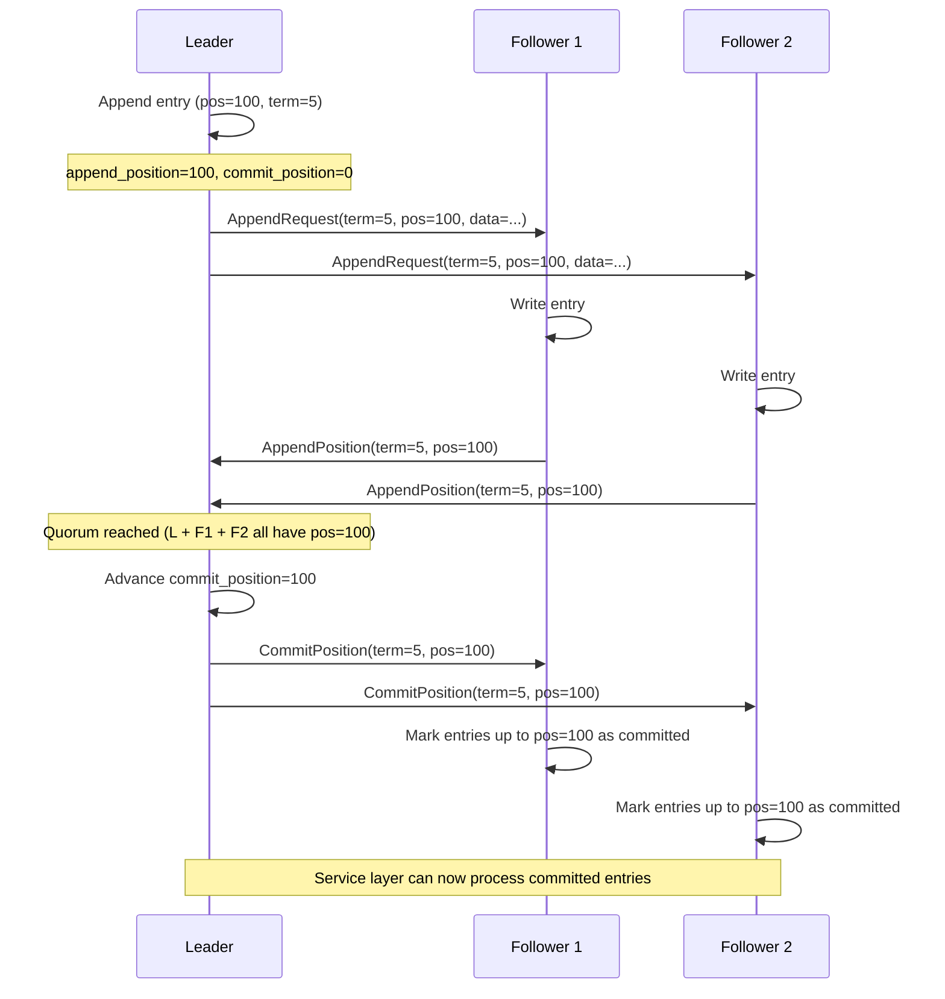

# 6.3 Log Replication

A leader is only useful if it can convince followers to replicate entries. The Raft replication protocol is beautifully simple: the leader sends batches of entries to followers; followers acknowledge each batch; when a quorum has acknowledged, the leader announces "it's safe — commit this."

This chapter explains the replication flow, the commit index safety property, and how to implement the quorum check.

## What You'll Build

By the end of this chapter, you'll understand:
- The log entry lifecycle: append (leader) → replicate (followers) → ACK → commit
- Why the commit index only advances when a quorum ACKs (the safety guarantee)
- The `AppendRequest` / `AppendPosition` / `CommitPosition` message flow
- What happens during a leader failover (new leader replays uncommitted entries)
- How to calculate "is this entry committed?"

## Why It Works This Way (Aeron Concept)

In Raft, the **log is the source of truth**. Once a majority of nodes have a log entry, that entry survives any node failures — even if the leader crashes and a follower becomes the new leader.

Real Aeron persists the cluster log to the Archive (a recorded stream). This gives durability:
- If a node crashes and restarts, it replays the log from the archive to rebuild its state machine
- If a new leader is elected, it can safely tell followers "here's where your log should be"

The protocol itself is straightforward:

1. **Leader appends** an entry to its local log when a client publishes a message
2. **Leader broadcasts** `AppendRequest` messages to all followers, carrying entry data
3. **Followers receive and write** entries to their local logs
4. **Followers send back** `AppendPosition` ACKs: "I've written entries up to position X"
5. **Leader tracks follower ACKs** and calculates: "have a quorum (including me) reached position X?"
6. **If yes, leader advances commit_position** and broadcasts `CommitPosition` to all followers
7. **Service layer reads committed entries** and processes them (idempotently, in order)

### The Replication Sequence



### Commit Index Safety

The key insight: **commit_position advances only when a quorum ACKs**.

Why? Suppose the leader crashes right after appending an entry:
- Scenario A: 3 nodes (leader, F1, F2). Leader appends, writes locally, then crashes before sending AppendRequest.
- F1 and F2 don't have the entry. A new leader is elected (say, F1). The entry is lost.
- Lesson: writing locally is not enough. Must reach a quorum.

So the protocol enforces: only after the leader knows a quorum has the entry does it say "this is committed."

### Follower Failover

If the leader crashes:
1. F1 gets elected as the new leader
2. F1's log is guaranteed to have all committed entries (because only entries on a quorum are committed)
3. F1 can send `NewLeadershipTerm` to F2 and all followers, telling them to truncate uncommitted entries

## Zig Concept: Atomic Commit Index + `std.ArrayList` for In-Flight Entries

How do we track which followers have which entries? We use a simple array:

```zig
pub const LogLeader = struct {
    /// Tracks the latest log_position each follower has acknowledged.
    follower_positions: []i64,  // Index is follower member_id, value is latest ACK'd position
    // ...
};
```

When we receive `AppendPosition` from follower 0:
```zig
self.follower_positions[0] = ack_position;
```

Then we calculate quorum:
```zig
var count: u32 = 1;  // Count ourselves (leader)
for (self.follower_positions) |pos| {
    if (pos >= target_position) {
        count += 1;
    }
}
const quorum_size = (self.cluster_size / 2) + 1;
if (count >= quorum_size) {
    // Safe to commit
}
```

For in-flight entries, we use `std.ArrayList`:

```zig
pub const ClusterLog = struct {
    entries: std.ArrayList(LogEntry),  // Dynamic array of entries
    append_position: i64 = 0,
    commit_position: i64 = 0,
    // ...

    pub fn append(self: *ClusterLog, data: []const u8, timestamp: i64) !i64 {
        const owned_data = try self.allocator.dupe(u8, data);
        const entry = LogEntry{
            .position = self.append_position,
            .timestamp = timestamp,
            .data = owned_data,
        };
        try self.entries.append(entry);
        self.append_position += @intCast(data.len);
        return entry.position;
    }
};
```

As entries are appended, they go into the list. As followers ACK, we advance `commit_position`. Service reads from `commit_position` up to `append_position`.

## The Code

Open `src/cluster/log.zig`:

```zig
pub const LogEntry = struct {
    position: i64,      // Byte offset in the log
    timestamp: i64,     // When appended
    data: []const u8,   // Entry payload (owned by the log)
};

pub const ClusterLog = struct {
    entries: std.ArrayList(LogEntry),
    append_position: i64 = 0,          // Where new entries will go
    commit_position: i64 = 0,          // Highest committed position
    leader_ship_term_id: i64 = 0,      // Current term
    allocator: std.mem.Allocator,

    pub fn init(allocator: std.mem.Allocator) ClusterLog {
        return .{
            .entries = std.ArrayList(LogEntry).init(allocator),
            .allocator = allocator,
        };
    }

    pub fn append(self: *ClusterLog, data: []const u8, timestamp: i64) !i64 {
        const owned_data = try self.allocator.dupe(u8, data);
        const entry = LogEntry{
            .position = self.append_position,
            .timestamp = timestamp,
            .data = owned_data,
        };
        try self.entries.append(entry);
        const pos = self.append_position;
        self.append_position += @intCast(data.len);
        return pos;
    }

    pub fn canCommit(self: *ClusterLog, quorum_position: i64) void {
        if (quorum_position > self.commit_position) {
            self.commit_position = quorum_position;
        }
    }

    pub fn entriesAfterCommit(self: *ClusterLog) []LogEntry {
        // Return entries that are appended but not yet committed
        const result = self.entries.items;
        var count: usize = 0;
        for (result) |entry| {
            if (entry.position < self.commit_position) {
                count += 1;
            }
        }
        return result[0..count];
    }

    pub fn committedEntries(self: *ClusterLog) []LogEntry {
        // Return entries that have been committed
        const result = self.entries.items;
        var count: usize = 0;
        for (result) |entry| {
            if (entry.position < self.commit_position) {
                count += 1;
            }
        }
        return result[0..count];
    }
};
```

The follower side is simpler:

```zig
pub const LogFollower = struct {
    entries: std.ArrayList(LogEntry),
    latest_acknowledged_position: i64 = 0,
    allocator: std.mem.Allocator,

    pub fn init(allocator: std.mem.Allocator) LogFollower {
        return .{
            .entries = std.ArrayList(LogEntry).init(allocator),
            .allocator = allocator,
        };
    }

    pub fn receiveAppend(self: *LogFollower, data: []const u8, position: i64, timestamp: i64) !void {
        const owned_data = try self.allocator.dupe(u8, data);
        try self.entries.append(.{
            .position = position,
            .timestamp = timestamp,
            .data = owned_data,
        });
        self.latest_acknowledged_position = position + @as(i64, @intCast(data.len));
    }
};
```

And the leader's view of follower progress:

```zig
pub const LogLeader = struct {
    cluster_size: u32,
    follower_positions: []i64,  // Indexed by member_id
    allocator: std.mem.Allocator,

    pub fn init(allocator: std.mem.Allocator, cluster_size: u32) !LogLeader {
        const positions = try allocator.alloc(i64, cluster_size);
        for (positions) |*pos| {
            pos.* = 0;
        }
        return .{
            .cluster_size = cluster_size,
            .follower_positions = positions,
            .allocator = allocator,
        };
    }

    pub fn onAppendPosition(self: *LogLeader, follower_id: u32, position: i64) void {
        if (follower_id < self.follower_positions.len) {
            self.follower_positions[follower_id] = position;
        }
    }

    pub fn getCommitPosition(self: *LogLeader, target_position: i64) i64 {
        var positions_at_target: u32 = 1;  // Count leader
        for (self.follower_positions) |pos| {
            if (pos >= target_position) {
                positions_at_target += 1;
            }
        }

        const quorum_size = (self.cluster_size / 2) + 1;
        if (positions_at_target >= quorum_size) {
            return target_position;
        }
        return 0;  // Not yet committed
    }
};
```

The leader uses `getCommitPosition`: given a target position, check how many followers have ACK'd it. If quorum, it's committed.

## Exercise

**Implement the quorum check: given follower ACK positions, determine if a position is committed.**

Open `tutorial/cluster/log.zig` and implement:

```zig
/// Quorum check for log replication.
/// Given an array of follower positions and a target position,
/// determine if a quorum (including the leader) has the target position.
pub fn isPositionCommitted(
    follower_positions: []const i64,
    target_position: i64,
    cluster_size: u32,
) bool {
    // TODO: implement
    @panic("TODO: isPositionCommitted");
}
```

**Acceptance criteria:**
1. Count followers with `position >= target_position`
2. Add 1 for the leader (always has its own entries)
3. Return true if total >= `(cluster_size / 2) + 1`
4. Write a test: 3-node cluster, set follower positions [100, 100], verify position 100 is committed
5. Write another test: 3-node cluster, set follower positions [100, 50], verify position 100 is NOT committed

**Hint:** Quorum size is `(cluster_size / 2) + 1`. For 3 nodes, that's 2. For 5 nodes, that's 3.

## Check Your Work

```bash
cd /Users/azusachino/Projects/project-github/harus-aeron-zig
make test-unit
```

Look for tests named something like `test_log_replication_*` or `test_quorum_*`.

## Key Takeaways

1. **Log replication is the heart of consensus**: entries must reach a majority before they're safe.
2. **Commit index lags append index**: appended entries are locally durable; committed entries are globally durable (survived leader failover).
3. **Quorum = majority**: (N/2)+1 nodes ensures that any two majorities overlap. If the leader crashes, the new leader is guaranteed to have all committed entries.
4. **Followers are passive**: they write entries and send ACKs; the leader does all the work of tracking who has what.
5. **In-flight tracking**: use an array indexed by member_id to track each follower's progress. Simple, O(N), and clear.

Next, we'll see how the conductor routes client messages through this log.
