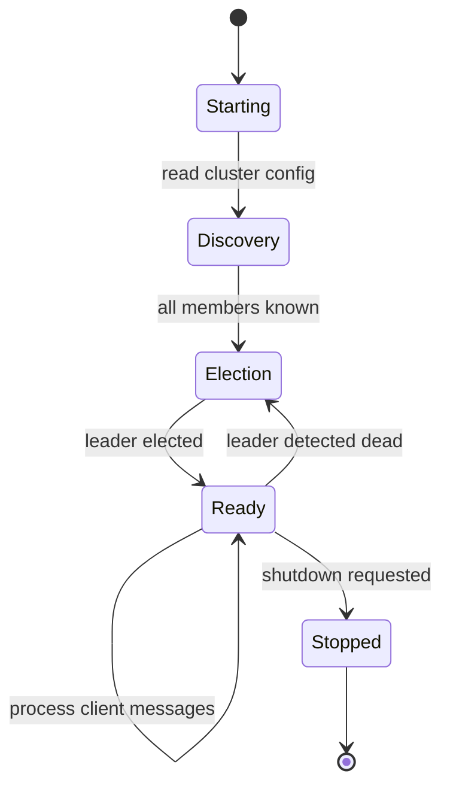

# 6.5 Cluster Main

All the pieces — election, replication, and conductor — live inside a **ConsensusModule**, which is the top-level abstraction for a cluster node. The ConsensusModule drives the duty cycles of all subcomponents and manages the overall node lifecycle.

This chapter shows how to compose these parts, configure a cluster, and understand what happens during a node restart or leader failover.

## What You'll Build

By the end of this chapter, you'll understand:
- How the ConsensusModule owns and orchestrates Election, Log, and Conductor
- The `ClusterContext` configuration structure
- Node startup sequence: discovery → election → ready to serve
- Typical deployment patterns (3-node or 5-node clusters)
- What happens during a leader failover (step by step)

## Why It Works This Way (Aeron Concept)

Real Aeron Cluster (`aeron-cluster/src/main/java/io/aeron/cluster/ConsensusModule.java`) runs the following agents in parallel:

1. **ArchiveProxy**: publishes log entries to the Archive for durability
2. **ServiceProxy**: calls the application's `ClusteredService` interface
3. **Election**: state machine for leader election
4. **LogReplication**: pushes `AppendRequest` to followers, collects `AppendPosition` ACKs
5. **EgressPublisher**: publishes `SessionEvent` and service responses back to clients

These agents run on separate threads and coordinate through shared-memory rings and atomic counters. For this tutorial, we'll keep it simpler: a single `ConsensusModule` that drives all components sequentially.

### Node Lifecycle



**Starting**: Parse config, initialize allocators, set up channel subscriptions.

**Discovery**: Subscribe to all cluster channels. Listen for existing leader or peer nodes.

**Election**: Run the election state machine. Wait for a leader to be elected.

**Ready**: Accept client connections, replicate log entries, serve committed entries to the application.

**Stopped**: Clean up, close subscriptions, free memory.

## Zig Concept: Multi-Thread Orchestration with `std.Thread`

Cluster work is parallelizable: while the sender is replicating entries to follower A, the receiver can be getting ACKs from follower B. But for this tutorial, we'll show how to compose the components sequentially and how threading would extend this.

### Standalone Example

```zig
const std = @import("std");

pub fn main() !void {
    var gpa = std.heap.GeneralPurposeAllocator(.{}){};
    defer _ = gpa.deinit();
    const allocator = gpa.allocator();

    // Simulate two workers
    var thread1 = try std.Thread.spawn(.{}, workerFn, .{ 1, allocator });
    var thread2 = try std.Thread.spawn(.{}, workerFn, .{ 2, allocator });

    thread1.join();
    thread2.join();
}

fn workerFn(id: i32, allocator: std.mem.Allocator) void {
    _ = allocator;
    std.debug.print("Worker {} running\n", .{id});
}
```

In a real cluster, you'd spawn threads for:
- `electorThread`: runs `election.doWork()` in a loop
- `replicatorThread`: runs `log_leader.sendAppendRequests()` in a loop
- `senderThread`: runs `transport.sendTo()` for all pending messages
- `receiverThread`: runs `transport.receiveFrom()` and routes to conductor

For now, we'll show the sequential version:

```zig
pub fn doWork(self: *ConsensusModule) !void {
    // All agents run sequentially on one thread
    try self.election.doWork(self.clock.now_ns());
    try self.conductor.doWork();
    try self.transport.poll();
}
```

Real Aeron would use threads and lock-free coordination. Zig's `std.Thread` module is the standard way.

## The Code

Open `src/cluster/cluster.zig`:

```zig
// =============================================================================
// MemberConfig — describes one node in the cluster
// =============================================================================

pub const MemberConfig = struct {
    member_id: i32,
    host: []const u8 = "localhost",
    client_port: u16 = 9010,    // Ingress channel port
    consensus_port: u16 = 9020, // Consensus/election port
    log_port: u16 = 9030,       // Log replication port
};

// =============================================================================
// ClusterContext — configuration for the entire node
// =============================================================================

pub const ClusterContext = struct {
    /// This node's unique member ID.
    member_id: i32,
    /// All cluster members' configurations.
    cluster_members: []const MemberConfig = &.{},
    /// Ingress channel for client connections.
    ingress_channel: []const u8 = "aeron:udp?endpoint=localhost:9010",
    ingress_stream_id: i32 = 100,
    /// Log replication channel.
    log_channel: []const u8 = "aeron:udp?endpoint=localhost:9020",
    log_stream_id: i32 = 101,
    /// Consensus/election channel.
    consensus_channel: []const u8 = "aeron:udp?endpoint=localhost:9030",
    consensus_stream_id: i32 = 102,
};

// =============================================================================
// ConsensusModule — top-level cluster node
// =============================================================================

pub const ConsensusModule = struct {
    allocator: std.mem.Allocator,
    ctx: ClusterContext,
    election: election_mod.Election,
    conductor: conductor_mod.ClusterConductor,
    is_running: bool = false,

    /// Initialize a new ConsensusModule.
    pub fn init(allocator: std.mem.Allocator, ctx: ClusterContext) !ConsensusModule {
        const cluster_size: u32 = if (ctx.cluster_members.len > 0)
            @intCast(ctx.cluster_members.len)
        else
            1;

        return ConsensusModule{
            .allocator = allocator,
            .ctx = ctx,
            .election = try election_mod.Election.init(allocator, ctx.member_id, cluster_size),
            .conductor = conductor_mod.ClusterConductor.init(allocator, ctx.member_id),
            .is_running = false,
        };
    }

    pub fn deinit(self: *ConsensusModule) void {
        self.election.deinit();
        self.conductor.deinit();
    }

    /// Start the cluster node.
    pub fn start(self: *ConsensusModule) !void {
        self.is_running = true;
        self.election.state = .init;
    }

    /// Shut down the cluster node gracefully.
    pub fn stop(self: *ConsensusModule) void {
        self.is_running = false;
    }

    /// Drive the consensus module's duty cycle once.
    /// In a real implementation, this would be called repeatedly by a scheduler.
    pub fn doWork(self: *ConsensusModule, now_ns: i64) !void {
        if (!self.is_running) return;

        // Step 1: Run the election state machine
        try self.election.doWork(now_ns);

        // Step 2: Update conductor's view of the current leader
        self.conductor.role = switch (self.election.state) {
            .leader_ready, .leader_log_replication => .leader,
            .candidate_ballot => .candidate,
            else => .follower,
        };
        self.conductor.leader_member_id = self.election.leader_member_id;
        self.conductor.leader_ship_term_id = self.election.leader_ship_term_id;

        // Step 3: Deliver committed entries to the service
        try self.conductor.deliverCommittedEntries();
    }

    /// Take a snapshot of the module's state for testing and recovery.
    pub fn getSnapshot(self: *ConsensusModule) !ConsensusModuleState {
        // Capture election state
        const election_members = try self.allocator.dupe(election_mod.MemberState, self.election.cluster_members);

        const election_snapshot = ElectionSnapshot{
            .state = self.election.state,
            .leader_member_id = self.election.leader_member_id,
            .candidate_term_id = self.election.candidate_term_id,
            .leader_ship_term_id = self.election.leader_ship_term_id,
            .log_position = self.election.log_position,
            .election_deadline_ns = self.election.election_deadline_ns,
            .votes_received = self.election.votes_received,
            .cluster_members = election_members,
        };

        // Capture conductor state
        var session_states = try std.ArrayList(conductor_mod.SessionState).initCapacity(
            self.allocator,
            self.conductor.sessions.count(),
        );
        var it = self.conductor.sessions.iterator();
        while (it.next()) |entry| {
            const channel = try self.allocator.dupe(u8, entry.value_ptr.response_channel);
            try session_states.append(.{
                .cluster_session_id = entry.value_ptr.cluster_session_id,
                .response_stream_id = entry.value_ptr.response_stream_id,
                .response_channel = channel,
                .is_open = entry.value_ptr.is_open,
            });
        }

        return ConsensusModuleState{
            .is_running = self.is_running,
            .election = election_snapshot,
            .conductor = conductor_mod.ClusterConductorState{
                .role = self.conductor.role,
                .leader_member_id = self.conductor.leader_member_id,
                .leader_ship_term_id = self.conductor.leader_ship_term_id,
                .next_session_id = self.conductor.next_session_id,
                .commit_position = self.conductor.log.commit_position,
                .sessions = session_states.items,
                .log_state = conductor_mod.log_mod.ClusterLogState{
                    .leader_ship_term_id = self.conductor.log.leader_ship_term_id,
                    .append_position = self.conductor.log.append_position,
                    .commit_position = self.conductor.log.commit_position,
                    .entries = &.{},
                },
            },
        };
    }
};

// =============================================================================
// Snapshot structures (for testing and recovery)
// =============================================================================

pub const ElectionSnapshot = struct {
    state: election_mod.ElectionState,
    leader_member_id: i32,
    candidate_term_id: i64,
    leader_ship_term_id: i64,
    log_position: i64,
    election_deadline_ns: i64,
    votes_received: u32,
    cluster_members: []election_mod.MemberState,

    pub fn deinit(self: *ElectionSnapshot, allocator: std.mem.Allocator) void {
        allocator.free(self.cluster_members);
        self.cluster_members = &.{};
    }
};

pub const ConsensusModuleState = struct {
    is_running: bool,
    election: ElectionSnapshot,
    conductor: conductor_mod.ClusterConductorState,

    pub fn deinit(self: *ConsensusModuleState, allocator: std.mem.Allocator) void {
        self.election.deinit(allocator);
        self.conductor.deinit(allocator);
    }
};
```

Notice:
- `ClusterContext` holds all configuration: member IDs, channels, ports
- `ConsensusModule` owns the election and conductor
- `doWork()` runs the agents sequentially: election → conductor → replication
- `getSnapshot()` captures state for testing and crash recovery

## Exercise (Prose)

**Describe what happens during a 3-node cluster leader failover, step by step.**

Scenario:
- 3-node cluster: A (leader, term=5), B (follower, term=5), C (follower, term=5)
- A crashes at time T=0
- B's election timeout is 1.1 seconds; C's is 1.5 seconds
- All nodes have identical log state (position=100, all committed)

Write out the sequence of events:

1. **T=0**: A crashes. B and C don't know yet; they're still in `follower_ready`.
2. **T=1.1s**: B's election timer fires. B transitions to `canvass`, then immediately to `candidate_ballot`.
3. B increments its candidate term to 6 and sends `RequestVote` to A and C.
4. C hasn't crashed; it receives B's `RequestVote(term=6)`. C's term is 5, so it votes for B.
5. A doesn't respond (it's down).
6. B gets 2 votes (itself + C). Quorum reached. B transitions to `leader_ready`.
7. **T=1.5s**: C's timer fires. But C has already seen B's `NewLeadershipTerm(term=6, leader_id=B)`, so it goes to `follower_ready`.
8. New leader is B. Clients reconnect to B.

Write this as a timeline, then explain why A crashing doesn't cause data loss.

**Acceptance criteria:**
- Timeline includes all 8 steps (or similar)
- Explains why the cluster recovers automatically (quorum election)
- Explains why data isn't lost (B already had the committed entries)
- Notes that A restarting will receive `NewLeadershipTerm` and catch up via log replication

## Check Your Work

```bash
cd /Users/azusachino/Projects/project-github/harus-aeron-zig
make test-unit
```

Look for integration tests like `test_3node_election` or `test_leader_failover`.

## Deployment Note: 3-Node vs 5-Node Clusters

**3-node cluster**: minimum for quorum. Quorum = 2. Tolerates 1 failure.
- Pros: low latency (fewer ACKs), cheap
- Cons: not fault-tolerant to 2+ simultaneous failures

**5-node cluster**: common for production. Quorum = 3. Tolerates 2 failures.
- Pros: survives 2 simultaneous failures; leaders elected consistently
- Cons: higher latency (more ACKs), higher cost

Real Aeron often uses a **2+1 configuration**: two voting nodes + one observer. Observer receives replicated entries but doesn't vote, saving resources.

## Key Takeaways

1. **ConsensusModule is the orchestrator**: owns election, log, and conductor; runs their duty cycles.
2. **ClusterContext is configuration**: channel URIs, member IDs, stream IDs — everything a node needs to join.
3. **Node startup is automatic**: no manual election or recovery needed. The election state machine handles it.
4. **Leader failover is survivable**: quorum election ensures the new leader has all committed entries.
5. **Deterministic state machine replication**: if a node crashes and restarts, it replays the committed log identically, recovering its state.

## Further Reading

- [Raft paper](https://raft.github.io/raft.pdf): the definitive reference for the algorithm
- [Aeron Cluster documentation](https://github.com/aeron-io/aeron/blob/master/aeron-cluster/README.md): real-world implementation details
- [Designing Data-Intensive Applications](https://dataintensive.net/), Chapter 9: replication and consensus algorithms

This concludes Part 6: Cluster. You now understand how Aeron Cluster coordinates a replicated log across multiple nodes and maintains a single consistent view of truth.

Congratulations — you've learned the complete Aeron stack: foundations, data path, driver, client library, archive, and cluster!
